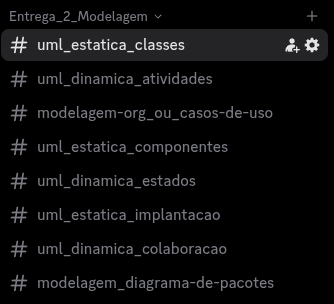
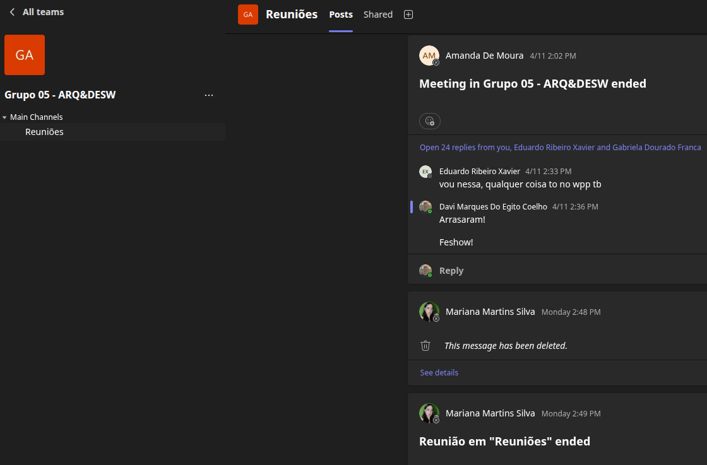
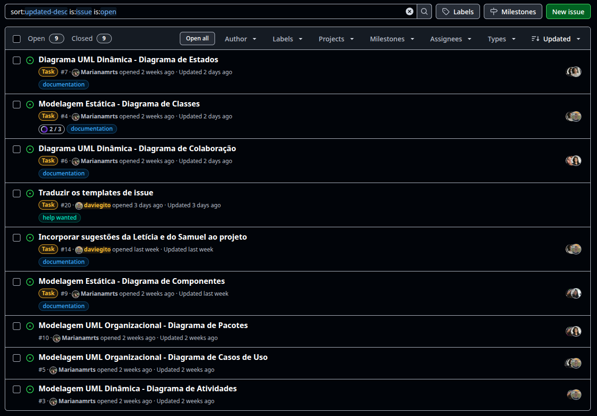
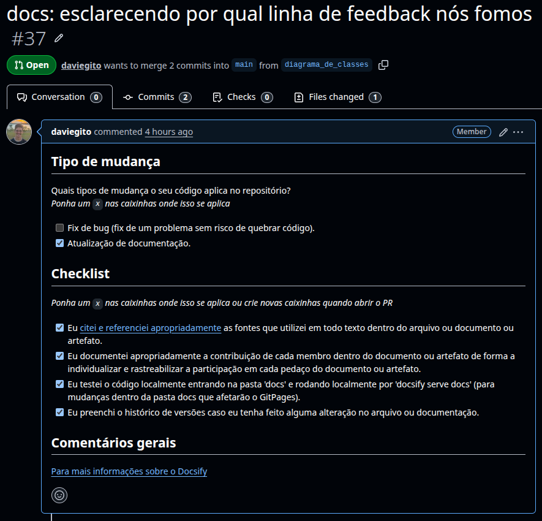
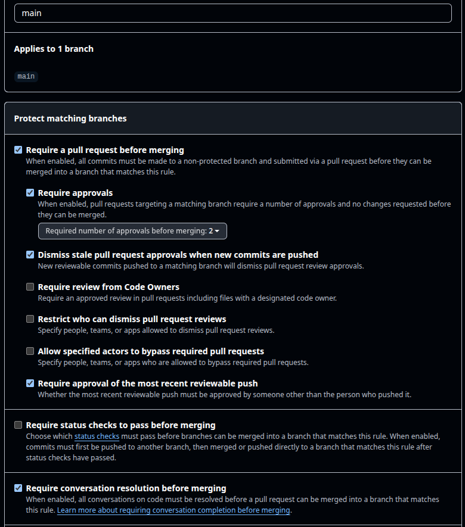

# 2.5. Iniciativas Extras (Modelagem)

## Organização e comunicação da equipe

Para fins de nos organizarmos melhor e fazermos as entregas, usamos algumas ferramentas para auxílio na confecção dos artefatos.

### Discord

Foi a nossa principal ferramenta de comunicação. Possuíamos um canal para cada entrega, onde ocorria grande parte da comunicação sobre o que estava sendo feito em cada artefato.

### Microsoft Teams

Para a realização das nossas reuniões semanais, usamos o Microsoft Teams, uma vez que ele permite a gravação de tais reuniões para fins de auxílio no registro das atas, especialmente a membros que não puderam comparecer.

### GitHub

Nossa principal ferramenta de fluxo de trabalho tanto para registro de issues, quanto para verificar a integridade dos arquivos e a coerência também.

Criamos, também, um template de Pull Request para facilitar a verificação de alguns padrões de qualidade antes do PR ser devidamente aceito. Pegamos alguns feedbacks a partir da apresentação da nossa primeira entrega para fazermos a devida confecção do [template de PR](https://github.com/UnBArqDsw2026-1-Turma02/2026.01-T02_G5_EuAmoPiri_Entrega_02/blob/main/.github/pull_request_template.md)

Uma lição aprendida com a entrega passada foi que a branch main precisa ser protegida ao máximo para evitar conflitos, garantir boas práticas de documentação e para que tudo seja revisado antes de ser entregue e garantirmos maior valor às nossas entregas. Com isso, houve a criação de regras para a proteção da main

## Histórico do documento

| Data       | Versão | Descrição                                                                 | Autor           | Revisores |
| ---------- | ------ | ------------------------------------------------------------------------- | --------------- | --------- |
| 23/04/2026 | 1.0.0  | Criação do documento inicial | [Davi do Egito](https://github.com/daviegito) |  |
