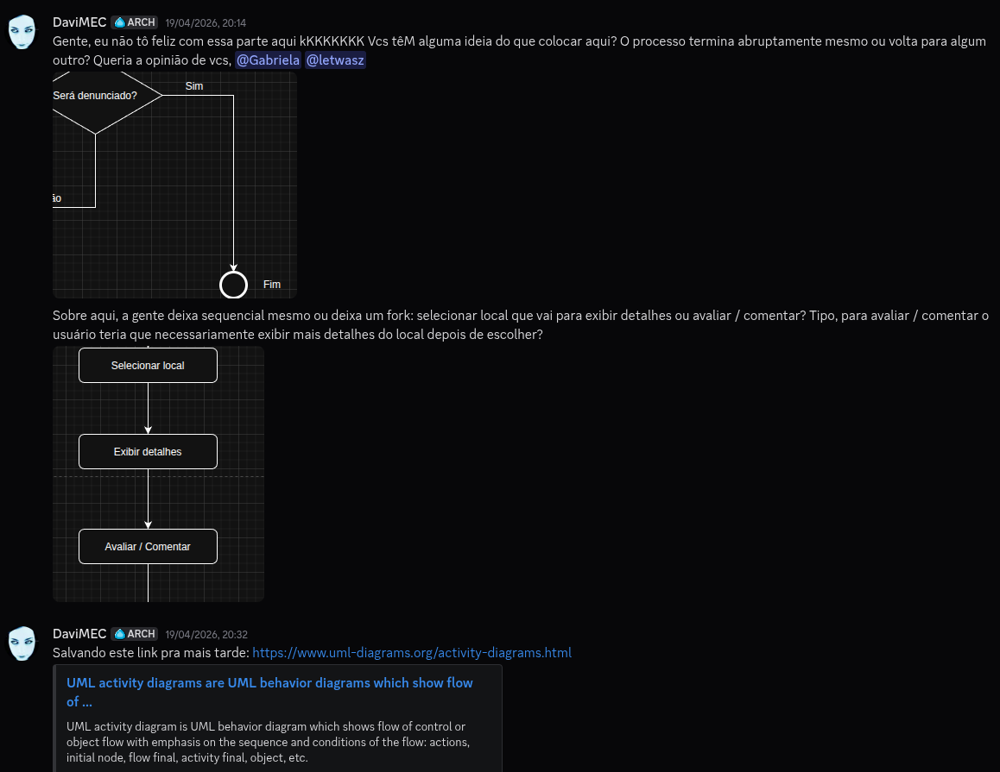
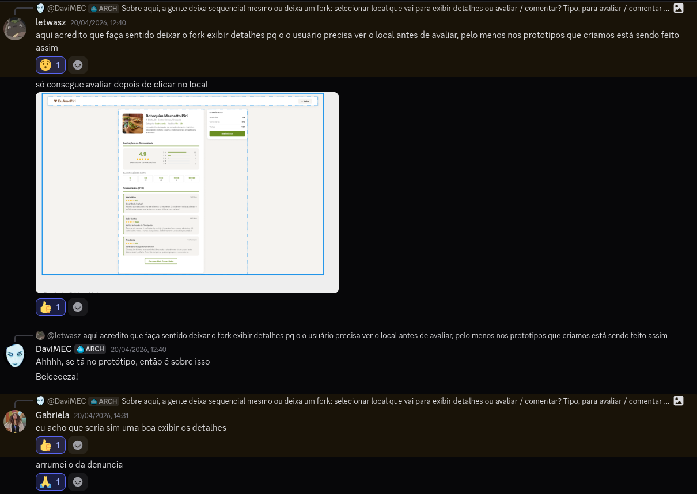
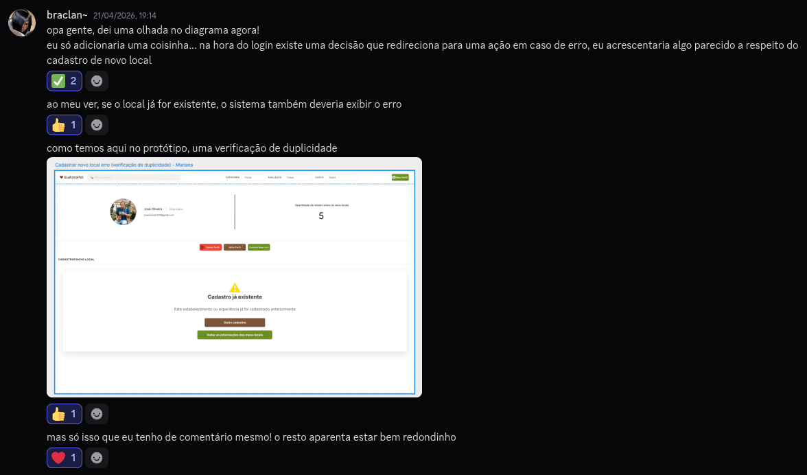
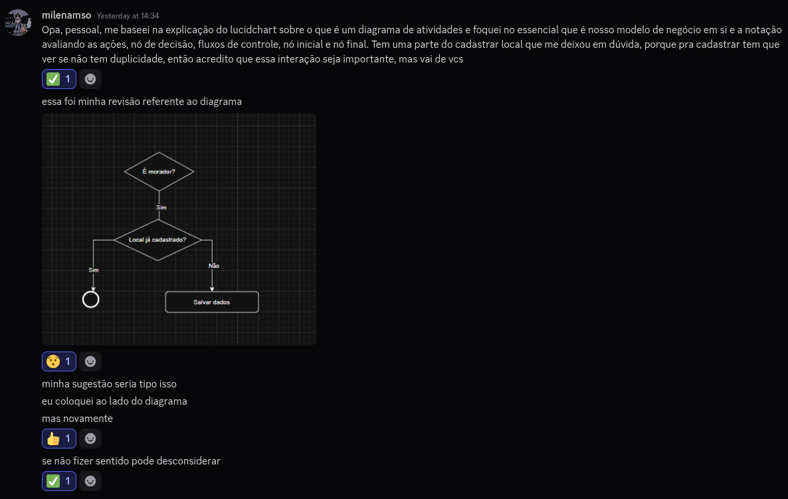

# 2.2.1 Diagrama de Atividades

## Introdução

Conforme Fakhroutdinov(2015), o diagrama de atividades mostra o fluxo de controle com ênfase na sequencialidade e condições atreladas a tal fluxo, em que as ações são iniciadas após outras acabarem, porque objetos e dados ficam disponíveis ou porque eventos externos ao fluxo ocorrem.

## Objetivo

O objetivo do diagrama de atividades é representar o fluxo de controle entre as atividades, evidenciando a sequência em que as ações ocorrem e as condições que influenciam esse fluxo. Dessa forma, permite compreender como as atividades são iniciadas e executadas ao longo do processo, conforme a conclusão de ações anteriores ou a ocorrência de eventos. (FAKHROUTDINOV, 2015)

## Metodologia

Davi (DaviMEC), Gabriela e Letícia (letwasz) usaram o Discord assincronamente para a confecção do artefato. Houve discussões internas sobre alguns pontos a se seguir e feedbacks também!

A discussão acima levou à versão 1.2, por exemplo. Para além disso, obtivemos feedback das revisoras também! 

Esses feedbacks das revisoras Anna (braclan~) e Milena (milenamso) geraram a versão 1.3!

## Evolução do artefato

### Versão 1.0 - rascunho

Letícia: criei a primeira versão com base nas atividades identificadas a partir dos protótipos no Figma, o que ajudou bastante a visualizar o fluxo inicial do sistema e estruturar o diagrama de atividades.

### Versão 1.1

Davi: eu sentia que ainda tinha alguma coisa faltando à questão da denúncia, e então a Letícia deu algumas ideias sobre como melhorar a abordagem da denúncia registrando-a, porque ir da denúncia diretamente ao final parecia estranho, ao meu ver.

### Versão 1.2

Davi: Após discussão entre os autores, optamos por fazer com que o registro da denúncia seja salvo antes da ação estar finalizada.

### Versão 1.3

Letícia: Com base no feedback das revisoras, avaliamos as sugestões e decidimos implementá-las em uma versão final consolidada, sendo eu e a Gabriela responsável por essa alteração.

 
>**Diagrama completo disponível em:**  
> https://drive.google.com/file/d/1PZJeHiV-ceiiTJsMpA72YzOQuqM6Wt1Q/view?usp=sharing

## Visão dos contribuidores na concepção do diagrama

Letícia: achei o processo tranquilo, pois já tínhamos todas as atividades documentadas em artefatos anteriores, então o maior desafio foi reunir e estruturar o diagrama de forma organizada. ao longo das revisões e ajustes, conseguimos alinhar melhor o fluxo e acredito que chegamos em um resultado bem consistente no geral.

Davi: achei esse diagrama particularmente fácil de entender, porque ele dá ênfase na sequencialidade, e a sequência lógica das atividades o deixa mais fácil de acompanhar e entender o que está acontecendo.

Gabriela: Achei esse diagrama bem assertivo e intuitivo, me deu uma boa base pra ir desenvolvendo os demais diagramas da Entrega 2. É um diagrama completo mas que também facilita a construção/visualização tanto para quem vai utilizar e quem desenvolveu.

## Referências 
> FAKHROUTDINOV, Kirill. UML 2.5 Activity Diagrams: **Activities**, 2015. uml-diagrams.org. [Acessado em: 21 Abr. 2026](https://www.uml-diagrams.org/activity-diagrams.html)

## Histórico do artefato
| Data       | Versão | Descrição                                                     | Autor                                                      | Revisores                                                                 |
| ---------- | ------ | ------------------------------------------------------------- | ---------------------------------------------------------- | ------------------------------------------------------------------------- |
| 18/04/2026 | `1.0`  | Criação do rascunho inicial                                   | [Letícia](https://github.com/leticiakrpaiva)               | —                                                                         |
| 18/04/2026 | `1.1`  | Adição do registro de denúncia                                | [Davi](https://github.com/daviegito)                       | —                                                                         |
| 20/04/2026 | `1.2`  | Inclusão do registro de denúncia como dado salvo antes do fim | [Davi](https://github.com/daviegito)                       | [Anna](https://github.com/annacbrandao) e [Milena](https://github.com/milenamso) |
| 18/04/2026 | `1.3`  | Ajustes com base na revisão dos membros                       | [Gabriela](https://github.com/gabrieladouradof) e [Letícia](https://github.com/leticiakrpaiva)            | —                                                                         |

## Histórico do documento
| Data       | Versão | Descrição                                                     | Autor                                                      | Revisores |
| ---------- | ------ | ------------------------------------------------------------- | ---------------------------------------------------------- | --------- |
| 21/04/2026 | `1.0`  | Criação do documento                                          | [Davi do Egito](https://github.com/daviegito)              | —         |
| 21/04/2026 | `1.1`  | Acréscimo de evidências para rastreabilidade                  | [Davi do Egito](https://github.com/daviegito)              | —         |
| 23/04/2026 | `1.2`  | Adição do objetivo e atualização da versão final| [Letícia](https://github.com/leticiakrpaiva)               | —         |