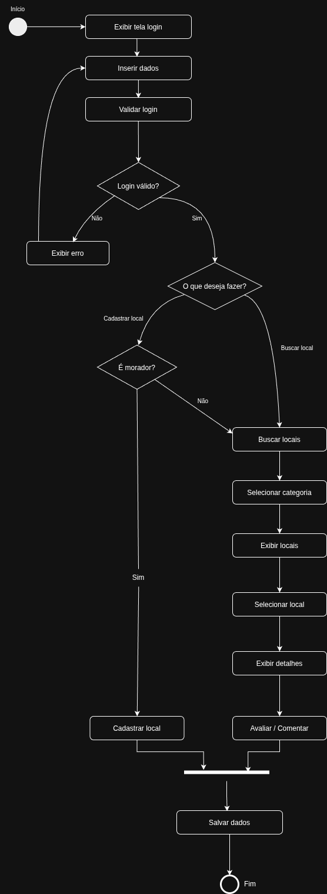
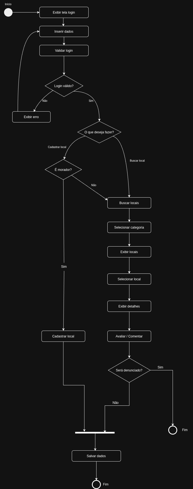
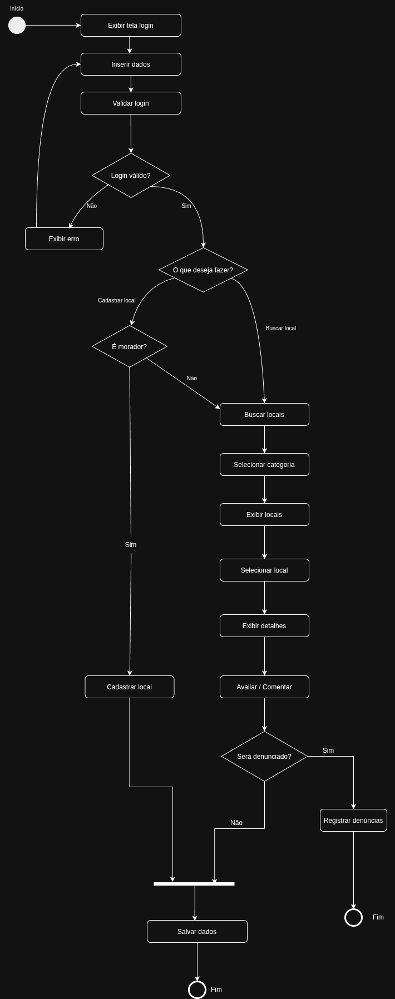
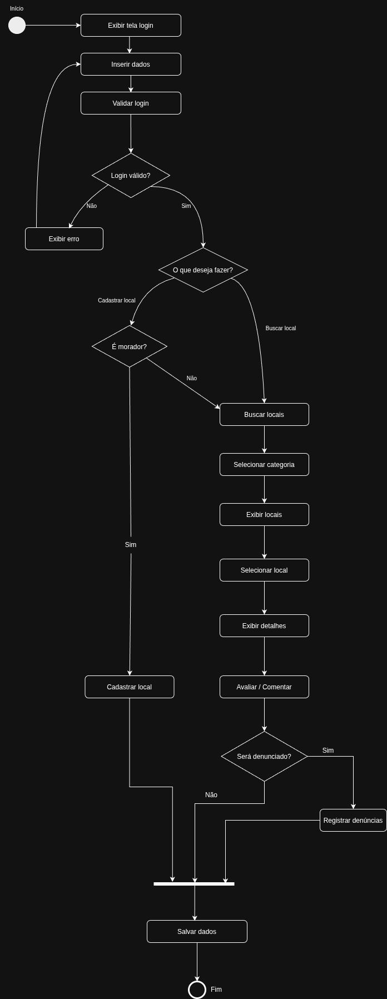

# 2.2.1 Diagrama de Atividades

## Introdução

Conforme Fakhroutdinov(2015), o diagrama de atividades mostra o fluxo de controle com ênfase na sequencialidade e condições atreladas a tal fluxo, em que as ações são iniciadas após outras acabarem, porque objetos e dados ficam disponíveis ou porque eventos externos ao fluxo ocorrem.

## Objetivo

[ESCREVER ALGO]

## Evolução do artefato

### Versão 1.0 - rascunho

[ESCREVER ALGO]

### Versão 1.1

Faltava um gateway que abordasse e filtrasse os comentários que eventualmente fossem denunciados. 

### Versão 1.2

[ESCREVER ALGO]

### Versão 1.3

Após discussão entre os autores, optamos por fazer com que o registro da denúncia seja salvo antes da ação estar finalizada.

## Visão dos contribuidores na concepção do diagrama

Letícia:

Davi: achei esse diagrama particularmente fácil de entender, porque ele dá ênfase na sequencialidade, e a sequência lógica das atividades o deixa mais fácil de acompanhar e entender o que está acontecendo.

Gabriela:

## Referências 
> FAKHROUTDINOV, Kirill. UML 2.5 Activity Diagrams: **Activities**, 2015. uml-diagrams.org. [Acessado em: 21 Abr. 2026](https://www.uml-diagrams.org/activity-diagrams.html)

## Histórico do artefato
| Data       | Versão | Descrição                                               | Autor                                                      | Revisores                                                                              |
| ---------- | ------ | ------------------------------------------------------- | ---------------------------------------------------------- | -------------------------------------------------------------------------------------- |
| 18/04/2026 | `1.0`  |                            | [Letícia](https://github.com/daviegito)              | ---------      
| 18/04/2026 | `1.1`  | Adição de registro de denúncia                           | [Davi](https://github.com/daviegito)              | ---------    
| 20/04/2026 | `1.2`  |                           | [Gabriela](https://github.com/daviegito)              | --------- |
| 20/04/2026 | `1.3`  | Colocação do registro da denúncia como dado salvo antes de finalizar                          | [Davi](https://github.com/daviegito)              | [Anna](https://github.com/annacbrandao) |

## Histórico do documento
| Data       | Versão | Descrição                                               | Autor                                                      | Revisores                                                                              |
| ---------- | ------ | ------------------------------------------------------- | ---------------------------------------------------------- | -------------------------------------------------------------------------------------- |
| 21/04/2026 | `1.0`  | Criação do documento                           | [Davi do Egito](https://github.com/daviegito)              | ---------      