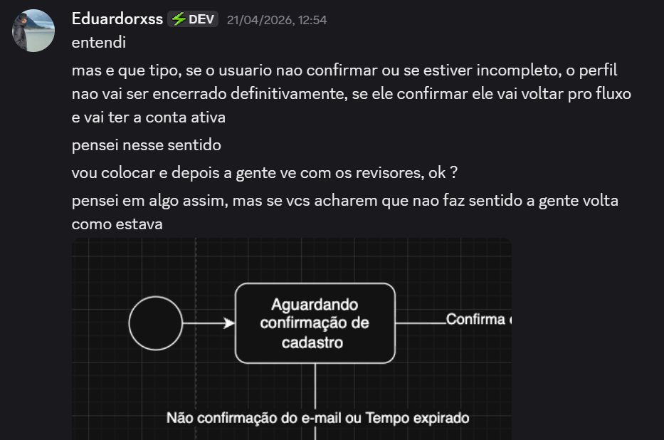
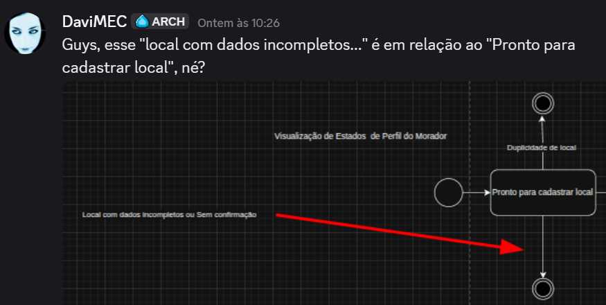
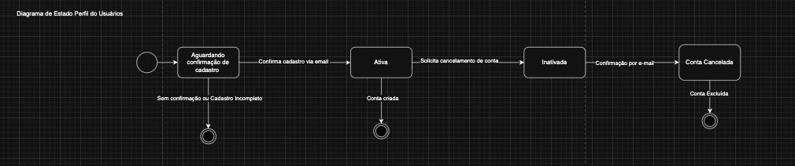
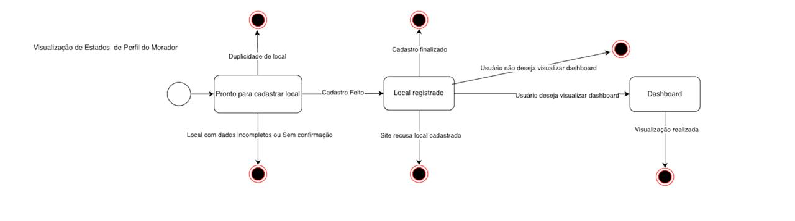
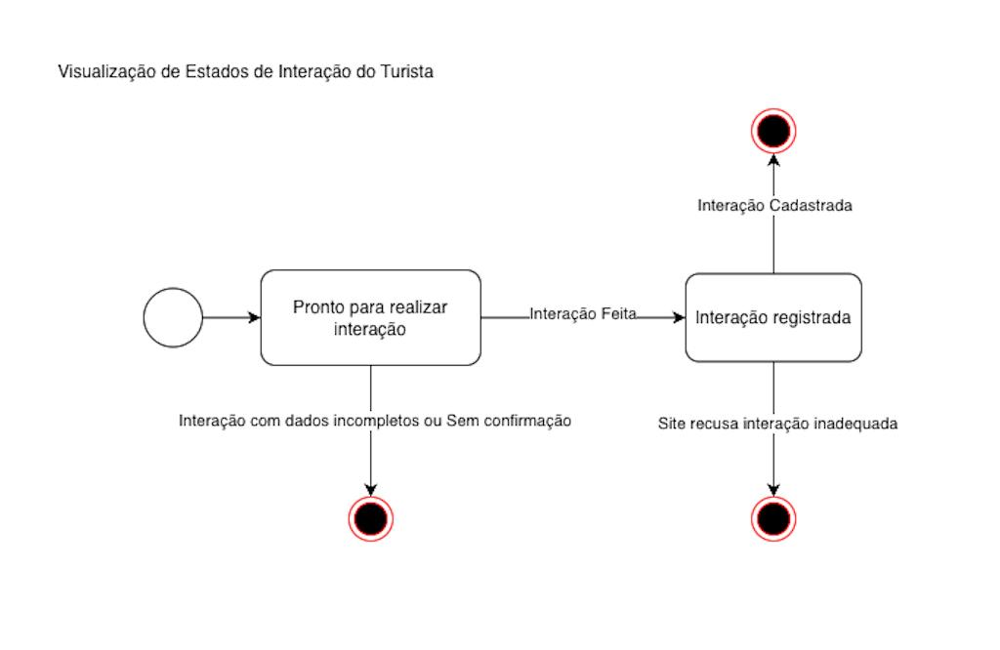
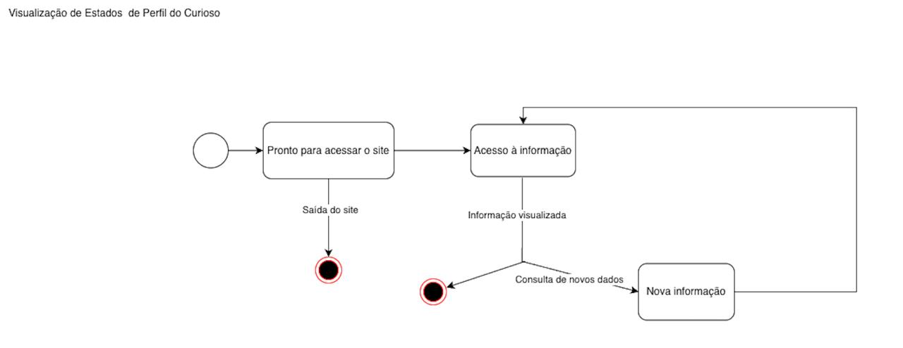

# 2.2.2 Diagrama de Estados

## Introdução

O diagrama de estados é um dos diagramas comportamentais da UML, utilizado para representar o comportamento dinâmico de um sistema ou de uma de suas partes. Esse tipo de diagrama descreve como um elemento do sistema se comporta ao longo do tempo, por meio da definição de estados e das transições entre esses estados. (UML DIAGRAMS, s.d.).

## Objetivo

O diagrama de estados tem como objetivo modelar o comportamento de um sistema ao longo do tempo, representando os diferentes estados em que um elemento pode se encontrar e como ocorrem as transições entre esses estados em resposta a eventos. (UML DIAGRAMS, s.d.).

## Metodologia

Mariana e Milena, fizeram a elaboração da V1 do Diagrama de Estados no Discord. A comunicação se deu de forma síncrona, por ligação. A comunicação com o Eduardo foi feita de forma síncrona, mas rápida e eficaz!

*Figura 1 - Ligação por vídeo* 

Fonte: Discord

As correções finais do Diagrama de Estados e documentação, foi feita pelo Edurado.

## Eduardo:

*Figura 2: Chat de Eduardo* 

Fonte: Discord

Solicitamos a revisão e feedback dos participantes: Davi, Samuel, Gabriela e Anna Clara.

## Davi:

*Figura 3: Chat de Davi*

Fonte: Discord

## Anna Clara:

*Figura 4: Chat de Anna Clara*

Fonte: Discord

## Samuel:

*Figura 5: Chat de Samuel*

Fonte: Discord

## Gabriela: 

*Figura 5: Chat de Gabriela*

Fonte: Discord

Com o feedback deles, foi possível chegar a uma conclusão mútua entre a equipe, assim, foi realizada a versão final do Diagrama de Estados.

# Diagramas produzidos

## Perfil do Usuario

### Estados do Perfil

Figura 1 — Diagrama de estados do perfil do usuário

## Estados do Processo

- **Aguardando confirmação do cadastro:** O usuário realizou o cadastro, mas ainda precisa confirmar seu e-mail para ativar a conta.

- **Conta ativa:** O cadastro foi confirmado com sucesso e o usuário pode utilizar normalmente o sistema.

- **Conta inativa:** O usuário solicitou o cancelamento da conta, interrompendo seu uso.

- **Conta cancelada:** A conta foi definitivamente encerrada após confirmação, não sendo mais possível utilizá-la.

### Transições e Eventos

- **Confirmação por e-mail:** Transição de _Aguardando confirmação do cadastro_ para _Conta ativa_, ocorre quando o usuário valida seu cadastro.

- **Solicitação de cancelamento:** Transição de _Conta ativa_ para _Conta inativa_, ocorre quando o usuário solicita o encerramento da conta.

- **Confirmação de cancelamento:** Transição de _Conta inativa_ para _Conta cancelada_, ocorre após a confirmação do cancelamento.

## Eventos de Finalização

- **Cadastro não confirmado:** Caso o usuário não finalize a confirmação do cadastro ou deixe o processo incompleto, o fluxo é encerrado.

- **Conta criada:** Representa a conclusão bem-sucedida do cadastro do usuário.

- **Conta excluída:** Após o cancelamento definitivo, o processo é finalizado.

## Perfil do morador (Cadastro de Local)

Figura 2 — Diagrama de estados do perfil do morador

## Estados do Processo

- **Pronto para cadastrar local:** Estado inicial onde o morador pode iniciar o cadastro de um novo local.

- **Local registrado:** O local foi cadastrado com sucesso no sistema.

- **Dashboard:** O usuário acessa a área de visualização dos dados após o cadastro do local.

---

## Transições e Eventos

- **Cadastro feito:** Transição de _Pronto para cadastrar local_ para _Local registrado_, ocorre quando o usuário finaliza o cadastro corretamente.

- **Usuário deseja visualizar dashboard:** Transição de _Local registrado_ para _Dashboard_, ocorre quando o usuário opta por acessar a visualização.

- **Usuário não deseja visualizar dashboard:** Representa a finalização do fluxo sem acessar o dashboard.

---

## Eventos de Finalização

- **Local com dados incompletos ou sem confirmação:** Caso o cadastro não seja concluído corretamente, o processo é encerrado.

- **Duplicidade de local:** Se o sistema identificar que o local já foi cadastrado, o fluxo é finalizado.

- **Cadastro finalizado:** Representa a conclusão bem-sucedida do cadastro do local.

- **Site recusa local cadastrado:** Caso o sistema rejeite o local após o cadastro, o processo é encerrado.

- **Visualização realizada:** Após acessar o dashboard, o fluxo é finalizado com sucesso.

## Interação do Turista

Figura 3 — Diagrama de estados de interação do turista

## Estados do Processo

- **Pronto para realizar interação:** Estado inicial onde o turista pode iniciar uma interação no sistema.

- **Interação registrada:** A interação foi realizada e registrada com sucesso no sistema.

---

## Transições e Eventos

- **Interação feita:** Transição de _Pronto para realizar interação_ para _Interação registrada_, ocorre quando o usuário conclui a ação corretamente.

---

## Eventos de Finalização

- **Interação com dados incompletos ou sem confirmação:** Caso a interação não seja concluída corretamente, o processo é encerrado.

- **Interação cadastrada:** Representa a finalização bem-sucedida da interação.

- **Site recusa interação inadequada:** Caso o sistema identifique a interação como inválida ou inadequada, o processo é encerrado.

## Perfil do Curioso

Figura 4 — Diagrama de estados do perfil do curioso

## Estados do Processo

- **Pronto para acessar o site:** Estado inicial onde o usuário pode iniciar a navegação.

- **Acesso à informação:** O usuário está visualizando conteúdos disponíveis no sistema.

- **Nova informação:** Representa a busca ou acesso a novos conteúdos dentro do sistema.

---

## Transições e Eventos

- **Acesso à informação:** Transição de _Pronto para acessar o site_ para _Acesso à informação_, ocorre quando o usuário entra em uma página de conteúdo.

- **Consulta de novos dados:** Transição de _Acesso à informação_ para _Nova informação_, ocorre quando o usuário busca ou navega para novos conteúdos.

- **Retorno à navegação:** Transição de _Nova informação_ para _Acesso à informação_, representando a continuidade da navegação no sistema.

---

## Eventos de Finalização

- **Saída do site:** O usuário encerra a navegação, finalizando o processo.

- **Informação visualizada:** Representa a conclusão de uma interação específica de visualização de conteúdo.

## Visão dos contribuidores na concepção do diagrama

- **Eduardo:** O diagrama de estados é uma ferramenta importante para a compreensão do comportamento do sistema ao longo do tempo, permitindo visualizar de forma clara os diferentes estados e as transições entre eles. Sua utilização contribui para a organização das regras de negócio, facilitando a identificação de fluxos principais, exceções e possíveis pontos de finalização. Dessa forma, o diagrama auxilia na construção de uma visão mais estruturada e consistente do funcionamento do sistema.

- **Mariana:** Realiazar a execução do Diagrama de Estados foi uma forma muito eficaz, transparente e didática de ilustrar como funcionam todos os potenciais estados de um sistema, assim como os eventos que podem provocam a mudança de um estado para o outro, trazendo uma visão mais sistémica e produtiva sobre o sistema que estamos elaborando.

## Referências

> UML DIAGRAMS. _UML State Machine Diagrams_. Disponível em: <https://www.uml-diagrams.org/state-machine-diagrams.html>. Acesso em: 21 abr. 2026.

> ABDALA, Marcelo. Diagrama de Estados. FACOM/UFU. Disponível em: https://www.facom.ufu.br/~abdala/DAS5312/Diagrama%20de%20Estados.pdf. Acesso em: 21 abr. 2026.

## Histórico do artefato

| Data       | Versão | Descrição                                          | Autor                                                                            | Revisores |
| ---------- | ------ | -------------------------------------------------- | -------------------------------------------------------------------------------- | --------- |
| 20/04/2026 | `1.0`  | Elaboração do rascunho do Diagrama de Estados e V1 | [Mariana](https://github.com/Marianamrts) [Milena](https://github.com/milenamso) | --------- |

## Histórico do documento

| Data       | Versão | Descrição                                                                                                                | Autor                                              | Revisores |
| ---------- | ------ | ------------------------------------------------------------------------------------------------------------------------ | -------------------------------------------------- | --------- |
| 21/04/2026 | `1.0`  | Documentação dos diagramas de estados, incluindo descrição dos estados, transições, eventos de finalização e referências | [Eduardo](https://github.com/EduardoRibeiroXavier) | --------- |
| 21/04/2026 | `1.1`  | Correção do versionamento do artefato e inclusão de legendas nas figuras                                                 | [Eduardo](https://github.com/EduardoRibeiroXavier) | [Anna Clara](https://github.com/annacbrandao) |
| 23/04/2026 | `1.2`  | Adição de Fonte usada para estudos e Visão pessoal de contribuição                                              |  [Mariana](https://github.com/Marianamrts) | [Anna Clara](https://github.com/annacbrandao) |
| 23/04/2026 | `1.3`  | Adição das contribuições em Metodologia                                             |  [Mariana](https://github.com/Marianamrts) | [Anna Clara](https://github.com/annacbrandao) |
