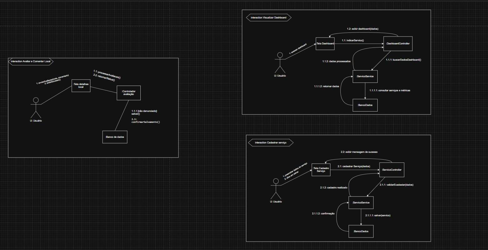
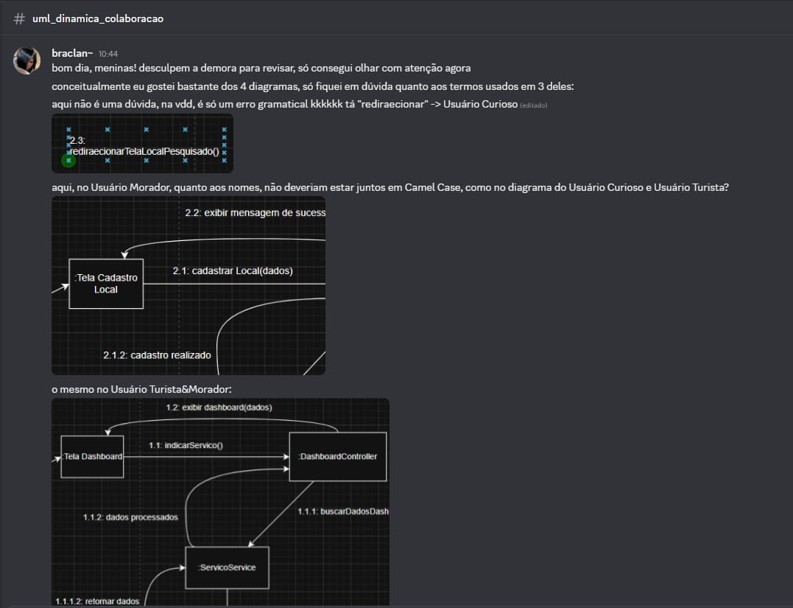
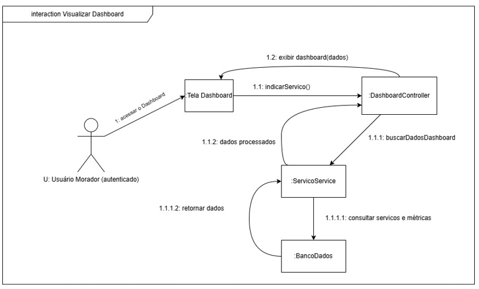
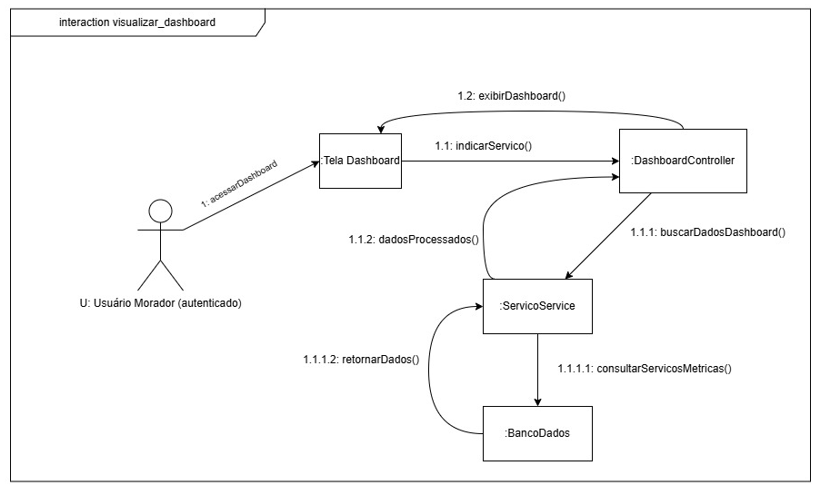
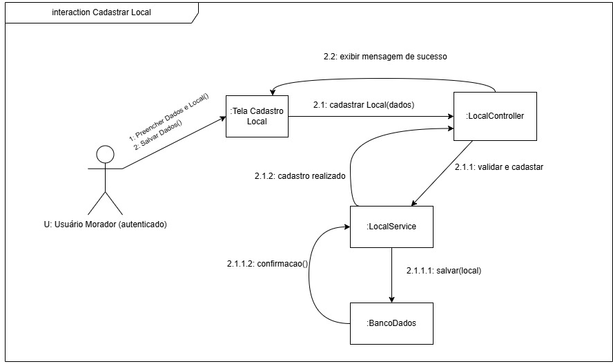
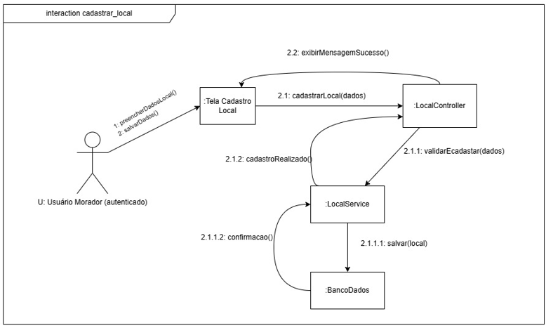
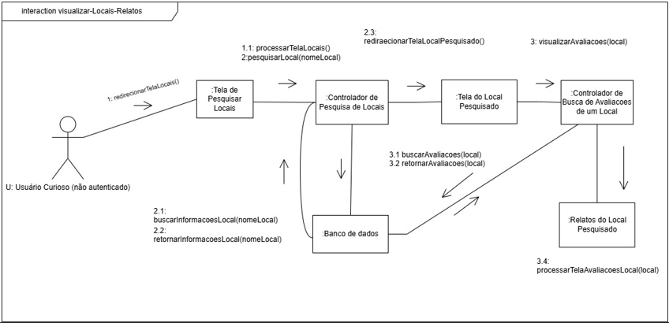
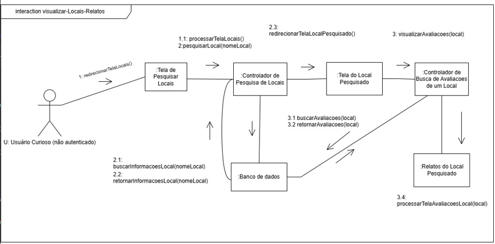
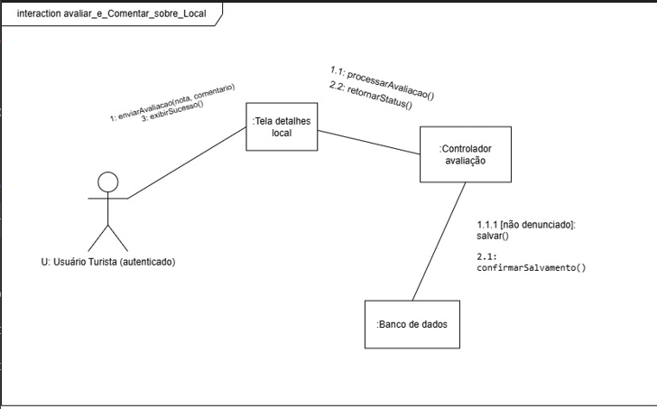

# 2.2.3 Diagrama de Colaboração

## Introdução

O diagrama de colaboração consiste em explorar a natureza dinâmica do software em construção, evidenciando o fluxo de mensagens entre objetos em uma aplicação orientada a objetos, além de indicar as associações básicas (relacionamentos) entre as classes (AMBLER, 2005).

Ainda com base na análise do capítulo UML Communication Diagrams, destacam-se algumas características importantes desse tipo de diagrama:

- Fornecer uma visão panorâmica (bird's-eye view) de um conjunto de objetos que colaboram entre si, sendo especialmente útil em ambientes de tempo real (AMBLER, 2005, p. 94);

- Servir como uma visão alternativa aos diagramas de sequência UML (AMBLER, 2005, p. 94);
- Permitir a atribuição de responsabilidades às classes ao explorar os aspectos comportamentais do sistema (AMBLER, 2005, p. 94);

- Modelar a lógica de implementação de operações complexas, especialmente aquelas que envolvem a interação com diversos objetos (AMBLER, 2005, p. 94);

- Analisar os papéis desempenhados pelos objetos dentro do sistema, bem como os diferentes relacionamentos estabelecidos ao exercerem tais funções (AMBLER, 2005, p. 94).

## Objetivo

O objetivo prático do uso de diagramas de comunicação pode variar conforme o nível de abstração adotado:

- Diagramas em nível de instância (instance-level): representam o estilo mais comum e têm como principal finalidade explorar o design interno do software orientado a objetos, com foco nas interações entre instâncias específicas (AMBLER, 2005);

- Diagramas em nível de especificação (specification-level): são utilizados para analisar e compreender os papéis assumidos pelas classes de domínio dentro do sistema, embora sejam menos utilizados na prática (AMBLER, 2005).

## Metodologia

Milena (milenamso), Amanda (Amanda de Moura) e Gabriela (Gabriela) usaram o Discord para a confecção do artefato. A comunicação se deu integralmente de forma assíncrona, mas constante. Cada insight ou ponto de melhoria era discutido para que a equipe pudesse refletir e refinar o artefato. Como exemplo, a discussão que levaria à criação da versão 1, elaborada por Gabriela e Milena.

Figura 1 — Diagrama de colaboração protótipo

O diagrama de colaboração foi dividido entre 3 membros da equipe, que trabalharam individualmente em diferentes interações. 
Para o feedback/revisão, aguardamos os comentários dos colegas que se prestaram a revisar o nosso diagrama: Leticia (samuelvlobo), Mariana (letwasz), Anna (braclan~) e Eduardo (Eduardorxss). Eles o fizeram de maneira assíncrona também no Discord!
Como ferramenta para a modelagem foi o utilizado o Draw.io.

Através do discord Anna(braclan~) percebeu inconsistência na construção do diagrama e levantou soluções possíveis para que alterações fossem realizadas a fim de aplicar melhorias.

Pontos Levantados pela análise de Anna: 

Figura 2 — Proposta de mudança Anna

Após mudanças sugeridas por Ana, as membras executoras fizeram os ajustes que ao longo do documento será demonstrado. Após essas alterações Anna aprovou o diagrama junto aos demais revisores: Mariana (letwasz), Anna (braclan~) e Eduardo (Eduardorxss).

Figura 2 — Proposta de mudança Anna

---

## Interação Visualizar Dashboard

### Versão sem correções

Figura 3 — Versão 1.0 sem alterações - Visualizar Dashboard 

### Versão com correções

Figura 4 — Versão 1.1 com alterações propostas por Anna - Visualizar Dashboard 

### Descrição Geral

O fluxo de visualização do dashboard descreve o processo pelo qual o usuário acessa, solicita e visualiza informações consolidadas sobre os serviços cadastrados no sistema. Esse processo envolve as camadas de interface (**Tela de Dashboard**), controle (**DashboardController**), regra de negócio (**ServicoService**) e persistência (**Banco de Dados**).

Segundo Sommerville (2011), a separação em camadas permite que cada parte do sistema seja desenvolvida e modificada de forma independente. Aplicando esse princípio, o projeto foi dividido em Tela de Dashboard, DashboardController, ServicoService e Banco de Dados. Na prática, isso facilita muito a manutenção: se decidirmos alterar completamente o visual da tela no futuro, não precisaremos mexer nas regras de negócio ou no banco de dados, pois a mudança afeta apenas a parte visual. Além disso, essa divisão garante a escalabilidade do sistema. Se a aplicação crescer e exigir mais recursos, poderemos facilmente separar o banco de dados e o processamento em servidores diferentes para dividir o esforço, permitindo que o projeto evolua sem precisar ser refeito do zero.

---

### Fluxo de Execução

#### 1. "acessarDashboard()"  
O processo tem início quando o usuário acessa a **Tela de Dashboard**, que disponibiliza a interface para visualização de métricas e informações dos serviços. A partir dessa interação, o sistema fica apto a receber a solicitação de dados.

#### 1.1 "indicarServiço()"  
O usuário seleciona ou informa o serviço desejado por meio de um componente da interface. Essa informação é utilizada como parâmetro para a busca de dados específicos no sistema.

#### 1.1.1 "buscarDadosDashboard()"  
A **Tela de Dashboard** envia a requisição ao **DashboardController**, que atua como intermediador e encaminha a solicitação ao **ServicoService**, responsável pelo processamento da lógica de negócio.

De acordo com Fowler (2002), a separação de responsabilidades entre componentes do sistema reduz o acoplamento e aumenta a coesão, contribuindo para a construção de sistemas mais organizados e de fácil manutenção. Nesse contexto, o **DashboardController** atua na coordenação das requisições, enquanto o **ServicoService** concentra a lógica de negócio, garantindo uma clara divisão de responsabilidades entre os componentes do sistema.

##### 1.1.1.1 "consultarServicosMetricas()"
O **ServicoService** acessa o **Banco de Dados** para recuperar as informações relacionadas ao serviço selecionado, incluindo métricas, indicadores e demais dados necessários para compor o dashboard.

##### 1.1.1.2 "retornarDados()"
Os dados recuperados são retornados ao **ServicoService**, que os organiza e os envia ao **DashboardController**, responsável por repassar a resposta à interface.

#### 1.1.2 "dadosProcessados()"  
Antes da exibição, os dados passam por tratamento, podendo incluir formatação, agregação e cálculo de métricas, garantindo que estejam adequados para visualização.

#### 1.2 "exibirDashboard()"
Por fim, a **Tela de Dashboard** apresenta os dados ao usuário de forma estruturada, utilizando elementos visuais como gráficos, tabelas ou indicadores, proporcionando uma visão clara e organizada das informações do serviço selecionado.

---

## Interação Cadastro de Local

### Versão sem correções

Figura 5 — Versão 1.0 sem alterações - Cadastrar Local 

### Versão com correções

Figura 6 — Versão 1.1 com alterações propostas por Anna - Cadastrar Local 

### Descrição Geral

O fluxo de cadastro de local descreve o processo pelo qual o usuário insere e registra um novo local no sistema. Esse processo envolve as camadas de interface (**Tela de Cadastro de Local**), controle (**LocalController**), regra de negócio (**LocalService**) e persistência (**Banco de Dados**).

---

### Fluxo de Execução

#### 1. "preencherDadosLocal()"  
O processo tem início quando o usuário acessa a **Tela de Cadastro de Local** e preenche os dados necessários para o registro, como nome, descrição, localização e demais informações relevantes. Essa etapa corresponde à entrada de dados pelo usuário, sendo essencial para o funcionamento adequado do sistema.

---

#### 2. "salvarDados()"  
Após o preenchimento, o usuário aciona a funcionalidade de salvar por meio da interface. Essa ação dispara uma requisição da **Tela de Cadastro de Local** para o **LocalController**, iniciando o processamento do cadastro.

#### 2.1 "cadastrarLocal(dados)"  
A requisição é recebida pelo **LocalController**, que atua como intermediador entre a interface e a lógica de negócio, encaminhando os dados ao **LocalService** para validação e processamento.

De acordo com Fowler (2002), a separação de responsabilidades entre componentes do sistema reduz o acoplamento e aumenta a coesão, contribuindo para sistemas mais organizados e de fácil manutenção. Assim, o controller é responsável pela coordenação do fluxo, enquanto o serviço concentra as regras de negócio.

#### 2.1.1 "validarEcadastrar(dados)" 
O **LocalService** realiza a validação dos dados fornecidos pelo usuário, verificando consistência, integridade e regras de negócio definidas pelo sistema. Apenas após a validação bem-sucedida, o processo de cadastro é efetivamente executado.

##### 2.1.1.1 "salvar(local)"
Com os dados validados, o **LocalService** realiza a persistência das informações no **Banco de Dados**, garantindo que o novo local seja armazenado de forma segura e estruturada.

##### 2.1.1.2 "confirmacao()" 
Após a operação de persistência, o **Banco de Dados** retorna uma confirmação ao **LocalService**, indicando que o registro foi realizado com sucesso.

#### 2.1.2 "cadastroRealizado()"  
O **LocalService** processa a confirmação e encaminha o resultado ao **LocalController**, que prepara a resposta para a interface, indicando que o cadastro foi concluído com sucesso.

#### 2.2 "exibirMensagemSucesso()"  
Por fim, a **Tela de Cadastro de Local** apresenta ao usuário uma mensagem de sucesso, confirmando que o local foi cadastrado corretamente no sistema.

---

### Considerações sobre o processo
Visão da participante: O desenvolvimento desse diagrama é crucial pro entendimento das camadas que iremos trabalhar ao decorrer do projeto, além de trazer clareza ao modelo de negócio deixa mais explícito como o processo funcionará ao time de desenvolvedores, é interessante porque tudo que foi trabalhado anteriormente vem a tona e sempre é preciso revisitar o escopo original para não fugir da proposta ou readaptar as necessidades da aplicação.

---

## Interação Visualizar Relatos e Locais

### Versão sem correções

Figura 7 — Versão 1.0 sem alterações - Cadastrar Local 

### Versão com correções

Figura 8 — Versão 1.1 com alterações propostas por Anna - Cadastrar Local 

---

### Descrição Geral

A interface de visualização de locais e relatos descreve o processo pelo qual um usuário não autenticado ("Usuário Curioso") pesquisa um ponto de interesse e acessa as avaliações vinculados a ele. O processo segue o padrão de arquitetura MVC, envolvendo a interface, controladores de busca especializados e a persistência de dados.

---

### Fluxo de Execução

#### 1.0 "redirecionarTelaLocais()"
O processo tem início quando o usuário interage com o sistema solicitando o acesso ao módulo de exploração. A interface redireciona o fluxo para a Tela de Pesquisar Locais, disponibilizando o campo de busca necessário para a interação.

##### 1.1 "processarTelaLocais()"
A Tela de Pesquisar Locais é renderizada e preparada pelo sistema. Esta etapa garante que os componentes visuais de busca estejam carregados e prontos para receber os parâmetros de entrada do usuário.

"pesquisarLocal(nomeLocal)"
O usuário informa o nome do local desejado. Essa ação dispara uma requisição da interface para o Controlador de Pesquisa de Locais, enviando o parâmetro nomeLocal para processamento.

---

#### 2.1 "buscarInformacoesLocal(nomeLocal)"
O Controlador de Pesquisa de Locais atua como intermediador e encaminha a solicitação de busca ao Banco de Dados.

##### 2.2 "retornarInformacoesLocal(nomeLocal)"
O Banco de Dados localiza o registro correspondente ao identificador único ou nome fornecido e retorna os dados brutos (descrição, fotos, coordenadas) ao controlador.

##### 2.3 "redirecionarTelaLocalPesquisado()"
Com os dados recuperados, o controlador processa a informação e redireciona o usuário para a Tela do Local Pesquisado, apresentando o perfil detalhado do destino selecionado.
"visualizarAvaliacoes(local)"
A partir da visualização do local, o sistema dispara (ou o usuário solicita) a exibição dos relatos vinculados. A Tela do Local Pesquisado envia uma requisição ao Controlador de Busca de Avaliações de um Local.

---

#### 3.1 "buscarAvaliacoes(local)"
O controlador especializado realiza uma nova consulta ao Banco de Dados, focada especificamente na tabela ou coleção de relatos e avaliações associados ao ID daquele local.

##### 3.2 "retornarAvaliacoes(local)"
O banco retorna o conjunto de relatos cadastrados por outros usuários, incluindo notas, comentários e metadados das avaliações.

##### 3.4 "processarComponenteAvaliacoesLocal(local)"

---

### Considerações sobre o processo

Por fim, os dados são encaminhados para o componente de Relatos do Local Pesquisado. Nesta etapa, ocorre o processamento final da interface, onde os relatos são formatados e exibidos de forma estruturada para o usuário, concluindo o ciclo de visualização.

Visão da participante: O diagrama de colaboração foi uma etapa muito importante para definirmos mais em um baixo nível como sereia a interação entre as partes menores do sistema (objetos), e as mensagens e/ou ações que seriam enviadas em cada uma das etapas, cumprindo objeitov de demonstrar uma colaboração dinâmica entre os objetos, tendo cada controlador com sua responsabilidade única (Busca de Local vs. Busca de Avaliações), seguindo um fluxo pensando nas etapas a serem feitas para que o usuário possa atingir um objetivo dentro do sistema.

---

## Interação envio de comentários e notas

### Versão com correções

Figura 9 — Versão 1.1 com alterações propostas por Anna - Cadastrar Local 

---

### Descrição Geral

A modelagem de envio de comentários e notas detalha os passos internos que ocorrem quando um "Usuário Turista" autenticado decide avaliar um destino. Seguindo a arquitetura MVC, o fluxo ilustra o caminho da requisição desde o front-end, passando pela validação de regras de negócio no controlador, até a escrita definitiva no banco de dados.

---

### Fluxos e Interações

#### 1 "enviarAvaliacao(nota, comentario)"
A interação começa na Tela de detalhes do local. O usuário insere sua nota e relato, e aciona o botão de envio. Essa ação dispara os parâmetros diretamente para o sistema iniciar o fluxo.

##### 1.1 "processarAvaliacao()"
A interface capta a interação e transfere a responsabilidade para o Controlador de Avaliação. O objetivo aqui é tirar os dados brutos da visão e passá-los para a camada lógica.

###### 1.1.1 [não denunciado]: salvar()
Este é o ponto crítico do fluxo. O Controlador não apenas repassa a informação; ele valida a regra de negócio. Ao checar a condição de guarda [não denunciado], o sistema garante que o conteúdo é válido antes de enviar o comando de persistência (salvar()) para o Banco de Dados.

---

#### 2.1 "confirmarSalvamento()"
O Banco de Dados realiza a operação de insert. Assim que a gravação é concluída com sucesso, ele devolve uma resposta ao Controlador confirmando que o novo registro está seguro.

##### 2.2 "retornarStatus()"
O Controlador de Avaliação recebe a confirmação do banco e traduz isso em um status de sucesso, enviando a resposta de volta para a camada de interface (Tela de detalhes do local).

---

#### 3 "exibirSucesso()"
Com o ciclo lógico finalizado, a Tela de detalhes do local renderiza uma notificação visual para o Turista, confirmando que sua avaliação foi publicada.

---

### Considerações sobre o processo

Visão da participante: A construção desse diagrama foi fundamental para visualizar a troca de mensagens "por debaixo dos panos" na hora de criar um registro novo no sistema. Diferente de uma simples consulta, a modelagem me ajudou a estruturar como a responsabilidade de validação deve ficar isolada no controlador. Representar a regra de negócio através da condição de guarda [não denunciado] deixou muito claro como os objetos devem colaborar para garantir a segurança dos dados antes de bater no banco, garantindo que o fluxo faça sentido de ponta a ponta até devolver o feedback visual para o usuário.

---

## Referências 

AMBLER, Scott W. UML communication diagrams. In: AMBLER, Scott W. *The Elements of UML 2.0 Style*. Cambridge: Cambridge University Press, 2005. p. 94-102.

SOMMERVILLE, Ian. Engenharia de software. Tradução de Ivan Bosnic e Kalinka G. de O. Gonçalves; revisão técnica Kechi Hirama. 9. ed. São Paulo: Pearson Prentice Hall, 2011.

FOWLER, Martin. *Patterns of Enterprise Application Architecture*. Boston: Addison-Wesley, 2002.

---

## Histórico do artefato
| Data       | Versão | Descrição  | Autor      | Revisores     |
| ---------- | ------ | ----------------------------- | --------------- | ------------------------------------- |
| 12/04/2026 | `1.0`  | Criação do diagrama no DrawIo  | [Davi do Egito](https://github.com/daviegito)   | [Milena Marques](https://github.com/milenamso)|
| 20/04/2026 | `1.1`  | Criação do primeiro esboço do diagrama - Interaction avaliar e comentar local | [Gabriela](https://github.com/gabrieladouradof)   | [Milena](https://github.com/milenamso)   [Amanda](https://github.com/AmandaaMoura) |
| 21/04/2026 | `1.2`  | Adicao das interactions Visualizar Dashboard e Interaction cadastrar local  | [Milena](https://github.com/milenamso)   |  [Amanda](https://github.com/AmandaaMoura)   [Gabriela](https://github.com/gabrieladouradof) |
| 21/04/2026 | `1.3`  |Padronizacao dos blocos de intearction do diagrama, correcao de nomenclaturas, de acordo com a entrega 1, especificação do tipo de usuário para cada interaction   | [Amanda](https://github.com/AmandaaMoura)    |  [Milena](https://github.com/milenamso)   [Gabriela](https://github.com/gabrieladouradof) |
| 21/04/2026 | `1.4`  | Adicao da interaction Visualizar Locais-Relatos  | [Amanda](https://github.com/AmandaaMoura)  | [Milena](https://github.com/milenamso)   [Gabriela](https://github.com/gabrieladouradof) |
| 23/04/2026 | `1.4.1`  | Sugestão de alterações no diagrama e correção de erros | [Anna](https://github.com/annacbrandao)  | [Milena](https://github.com/milenamso)   [Amanda](https://github.com/AmandaaMoura)   [Gabriela](https://github.com/gabrieladouradof) |
| 22/04/2026 | `1.5`  | Correção dos diagramas  | [Milena](https://github.com/milenamso)   |  [Amanda](https://github.com/AmandaaMoura)   [Gabriela](https://github.com/gabrieladouradof)   [Anna](https://github.com/annacbrandao)   |
| 23/04/2026 | `1.5.1`  | Revisores avaliam e aprovam o diagrama  | [Amanda](https://github.com/AmandaaMoura)   [Gabriela](https://github.com/gabrieladouradof)   [Milena](https://github.com/milenamso)   |    [Anna](https://github.com/annacbrandao)   [Eduardo](https://github.com/eduardodpms) [Mariana](https://github.com/Marianamrts)    [Leticia](https://github.com/leticiakrpaiva) |

## Histórico do documento
| Data       | Versão | Descrição                     | Autor         | Revisores        |
| ---------- | ------ | ------------- | ------------- | -------------------------------- |
| 12/04/2026 | `1.0`  | Criação do diagrama no DrawIo | [Davi do Egito](https://github.com/daviegito)   | [Milena](https://github.com/milenamso) |
| 23/04/2026 | `1.1`  | Elaboração da documentação | [Milena](https://github.com/milenamso)   [Amanda](https://github.com/AmandaaMoura)   [Gabriela](https://github.com/gabrieladouradof) | [Anna](https://github.com/annacbrandao)   [Eduardo](https://github.com/eduardodpms) [Mariana](https://github.com/Marianamrts)    [Leticia](https://github.com/leticiakrpaiva) | 
