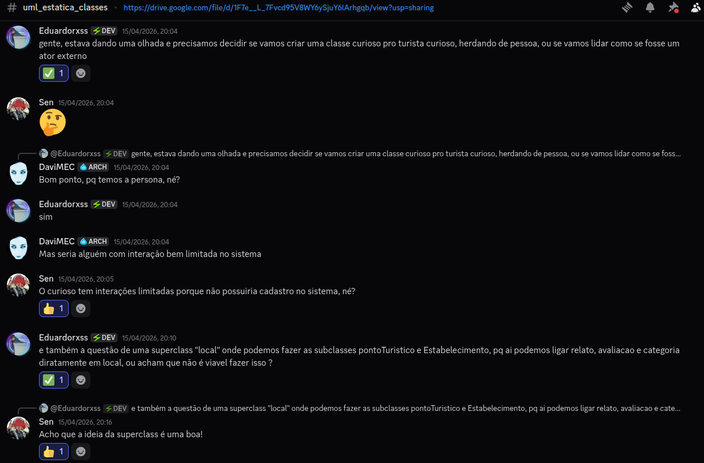
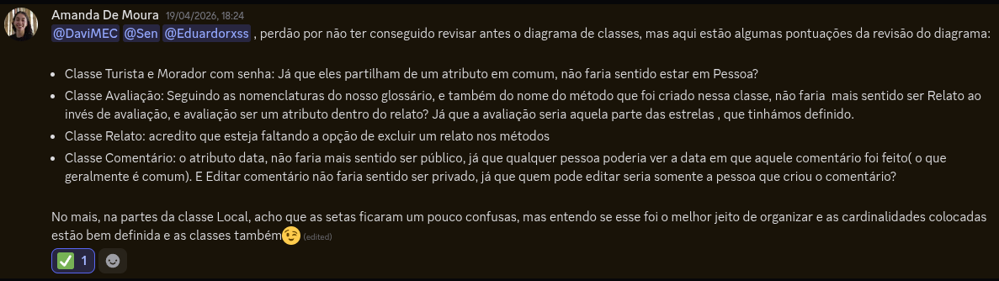

# 2.1.1 Diagrama de Classes

## Introdução

Um Diagrama de Classes é um dos principais artefatos da UML, utilizado na modelagem de sistemas orientados a objetos para representar a estrutura estática de uma aplicação.

Ele tem como objetivo descrever, de forma visual, como o sistema foi modelado, apresentando as classes, seus atributos, seus métodos e os relacionamentos existentes entre elas. Dessa forma, o diagrama permite compreender como as entidades do domínio estão organizadas e como interagem entre si.

Dentro do contexto de modelagem, o diagrama de classes é essencial para transformar requisitos do mundo real em uma representação estruturada, servindo como base para o projeto e implementação do sistema.

De acordo com Fábio dos Reis (2018), os principais relacionamentos utilizados na modelagem são:

- **Associação**: representa uma relação estrutural entre classes, indicando que objetos de uma classe se conectam a objetos de outra. Pode incluir **multiplicidade**, definindo quantas instâncias participam da relação.

- **Herança**: define uma relação hierárquica onde uma classe filha herda atributos e métodos de uma classe pai, promovendo reutilização e especialização na modelagem.

- **Agregação**: representa uma relação de “todo-parte” mais fraca, onde as partes podem existir independentemente do todo. É usada quando há composição lógica, mas sem dependência de ciclo de vida.

- **Composição**: é uma forma mais forte de agregação, onde as partes dependem totalmente do todo para existir. Nesse caso, há dependência de ciclo de vida entre os objetos.

- **Dependência**: indica que uma classe utiliza outra de forma temporária, geralmente como parâmetro de método ou variável local, sem manter uma relação estrutural permanente.

## Objetivo

O diagrama de classes tem como objetivo apoiar a modelagem estrutural do sistema, representando de forma clara e organizada as classes, seus atributos, métodos e os relacionamentos entre elas. Essa modelagem busca transformar os requisitos do domínio em uma estrutura orientada a objetos, servindo como base para o desenvolvimento da aplicação.

## Metodologia

Davi (DaviMEC), João (Sen) e Eduardo (Eduardorxss) usaram o Discord para a confecção do artefato. A comunicação se deu integralmente de forma assíncrona, mas constante. Cada insight ou ponto de melhoria era discutido para que a equipe pudesse refletir e refinar o artefato. Como exemplo, a discussão que levaria à criação da versão 1.6.

Para o feedback/revisão, aguardamos os comentários dos colegas que se prestaram a revisar o nosso diagrama: Samuel (samuelvlobo), Letícia (letwasz) e Amanda (Amanda de Moura). Eles o fizeram de maneira assíncrona também no Discord! 

Com o feedback deles, surgiu a versão 1.8 do nosso artefato!

## Evolução do artefato

### Template do DrawIO

Para elaboração do diagrama de classes, começamos com o template do próprio DrawIO

### Versão 1.1

João Victor: Para a primeira versão do diagrama, tentei definir as classes e atributos que julguei mais importantes para o projeto para que elas pudessem ser expandidas nas versões posteriores do diagrama. Mesmo ainda sendo um estágio inicial, ainda incentivou a tomada de decisões a respeito da implementação de funções discutidas e eventualmente levantou questões a serem ponderadas conforme a evolução do diagrama.

### Versão 1.2

Davi: para a versão 1.2, houve: a adição de interfaces, porque achei que fariam sentido, mas que acabamos descartando depois; a colocação de algumas cardinalidades de maneira preliminar também. Ainda faltava mexermos nos métodos, porém.

### Versão 1.3

Eduardo: Durante a evolução do diagrama, identificamos que as classes Estabelecimento e Ponto Turístico apresentavam diversos atributos em comum, como nome, descrição e informações relacionadas à localização. Diante disso, optamos por introduzir a superclasse Local, com o objetivo de centralizar essas características compartilhadas e evitar redundância na modelagem. Com essa alteração, também foi possível simplificar os relacionamentos existentes no modelo, facilitando a compreensão das entidades e suas interações dentro do domínio do sistema.

### Versão 1.4

Davi: Após discussão interna, chegamos à conclusão que algumas das relações entre as entidades eram de composição, uma vez que elas não poderiam existir sem uma outra entidade atrelada. Os exemplos mais emblemáticos são as entidades Avaliação, Relato e Comentário. O relato só consegue existir se houver uma avaliação atrelada, e os comentários, que seriam as réplicas e tréplicas em cima dos relatos, só poderiam existir caso o relato inicial existisse.

João Victor: Essa foi uma das versões do diagrama que nos trouxe mais questões a respeito de como o sistema funcionária com as relações que definimos em mente, nos levando a conclusão mencionada acima.

### Versão 1.5

Davi: Durante a nossa confecção, grande parte dos relacionamentos ainda estavam sem uma cardinalidade associada, então buscamos acrescentá-las entre as entidades.

### Versão 1.6

Davi: Ajustamos as relações entre a superclasse Local com as outras classes.

### Versão 1.7

Davi: Após discussão interna pelo Discord, chegamos à conclusão que algumas das cardinalidades estavam erradas, especialmente em relação às entidades com relação de composição. Buscamos consertar isso nesta versão e submetê-la à equipe revisora.

### Versão 1.8

Davi: após os feedbacks obtidos pela equipe revisora, discutimos e fizemos alterações para adequação às propostas apresentadas, as quais achamos relevantes para a ocasião. Optamos por colocar a avaliação como um atributo do relato, que é feito por um turista. 

### Link para o Draw.io

Clique [aqui](https://drive.google.com/file/d/1F7e__L_7Fvcd95V8WY6ySjuY6lArhgqb/view?usp=sharing) para acessar o diagrama.

## Visão dos contribuidores na concepção do diagrama

Eduardo: Durante a construção do diagrama de classes, tive um papel ativo principalmente na revisão e refinamento da modelagem, buscando alinhar melhor o diagrama com os conceitos de UML e com as definições levantadas no Lean Inception. Ao longo do processo, percebi que, apesar de inicialmente parecer simples, a modelagem exigiu várias revisões, principalmente na definição das relações entre as classes, como composição e herança. Um dos pontos em que mais contribuí foi na reorganização do modelo, como a criação da superclasse Local para evitar redundâncias entre Estabelecimento e Ponto Turístico, além de ajustes nas relações envolvendo Relato, Comentário e Avaliação.
Também participei ativamente das discussões com o grupo, ajudando a identificar inconsistências e propor melhorias para tornar o diagrama mais coerente e aderente ao funcionamento real do sistema. Esse processo contribuiu para consolidar meu entendimento sobre modelagem orientada a objetos e aplicação prática da UML.

Davi: apesar do diagrama de classes parecer mais simples que os outros estáticos à primeira vista, é sempre desafiador seguir a UML à risca, e muitas vezes tivemos de repensar o que estávamos fazendo pelo nosso canal do Discord reservado à confecção deste artefato. As cardinalidades foram um ponto particularmente desafiador para mim. Apesar de já ter visto antes e inclusive ter pego Bancos 1 no semestre passado, tive uma certa confusão em relação a elas quando se tratavam de uma relação de composição, porque o condicionamento da existência dessa relação me deixava confuso em relações 1 por 1, e 1 ou mais por qualquer número (\*).

João: mesmo tendo uma ideia básica de como o diagrama poderia ser modelado considerando o planejamento e as decisões que já haviamos feito até aquele momento a respeito do funcionamento do projeto, a modelagem do diagrama de classes foi se provando cada vez mais complexa conforme avançamos. A relação entre as classes e subclasses, além dos atributos presentes nelas, precisou ser repensada e discutida várias vezes entre os membros no nosso canal de comunicação do Discord. Mas, felizmente, isso nos ajudou a ter uma noção mais clara de como prosseguir.

## Referências

> BOOCH, Grady; RUMBAUGH, James; JACOBSON, Ivar. OMG Unified Modeling Language. Object Management Group (OMG). Disponível em: https://www.omg.org/spec/UML/#documents. Acessado em: 17 Abr. 2026

> UML-DIAGRAMS. Deployment Diagrams Overview. Disponível em: https://www.uml-diagrams.org/deployment-diagrams-overview.html.

> BÓSON TREINAMENTOS. Curso de UML O que é um Diagrama de Classes. [S. l.], 2018. 1 vídeo (17 min e 44 s). Disponível em: https://www.youtube.com/watch?v=JQSsqMCVi1k. Acessado em: 17 set. 2025.

## Histórico do artefato

| Data       | Versão | Descrição                                               | Autor                                                      | Revisores                                                                                                                         |
| ---------- | ------ | ------------------------------------------------------- | ---------------------------------------------------------- | --------------------------------------------------------------------------------------------------------------------------------- |
| 12/04/2026 | `1.0`  | Criação do diagrama no DrawIo                           | [Davi do Egito](https://github.com/daviegito)              |                                                                                                                          |
| 14/04/2026 | `1.1`  | Nomeação e criação das classes, definição dos atributos | [João Victor](https://github.com/Chaotzuu)                 |                                                                                                                        |
| 14/04/2026 | `1.2`  | Ajustes nas relações entre as classes                   | [Eduardo Ribeiro](https://github.com/EduardoRibeiroXavier) |
| 14/04/2026 | `1.3`  | Criação da superclasse Local                            | [Eduardo Ribeiro](https://github.com/EduardoRibeiroXavier) |
| 14/04/2026 | `1.4`  | Colocação das devidas composições                       | [Davi do Egito](https://github.com/daviegito)              |
| 15/04/2026 | `1.5`  | Colocação das cardinalidades                            | [Davi do Egito](https://github.com/daviegito)              |
| 15/04/2026 | `1.6`  | Ajustes nas relações entre as classes                   | [Eduardo Ribeiro](https://github.com/EduardoRibeiroXavier) |
| 15/04/2026 | `1.7`  | Conserto das cardinalidades                             | [Davi do Egito](https://github.com/daviegito)              | [Samuel](https://github.com/Samuelvlobo), [Letícia](https://github.com/leticiakrpaiva), [Amanda](https://github.com/AmandaaMoura) |
| 19/04/2026 | `1.8`  | Consertos pós-feedback                                  | [Davi do Egito](https://github.com/daviegito)              | [João Victor](https://github.com/Chaotzuu)                                                                                        |

## Histórico do documento

| Data       | Versão | Descrição                                                      | Autor                                                      | Revisores |
| ---------- | ------ | -------------------------------------------------------------- | ---------------------------------------------------------- | --------- |
| 15/04/2026 | `1.0`  | Criação inicial do documento e elaboração dos tópicos iniciais | [Eduardo Ribeiro](https://github.com/EduardoRibeiroXavier) |
| 17/04/2026 | `1.1`  | Adição histórico e versionamento dos artefatos                 | [Davi do Egito](https://github.com/daviegito)              |
| 18/04/2026 | `1.2`  | Adição de Referências e Visão                                  | [Eduardo Ribeiro](https://github.com/EduardoRibeiroXavier) |
| 20/04/2026 | `1.3`  | Correção dos links das imagens                                 | [João Victor](https://github.com/Chaotzuu)                 |
| 21/04/2026 | `1.4`  | Adição histórico e versionamento dos artefatos                 | [Eduardo](https://github.com/EduardoRibeiroXavier)         |
| 21/04/2026 | `1.5`  | Citação na sessão de introdução, ajustes nas fontes            | [João Victor](https://github.com/Chaotzuu)         |
| 22/04/2026 | `1.6`  | Adição de metodologia e consertos            | [Davi do Egito](https://github.com/daviegito)         |