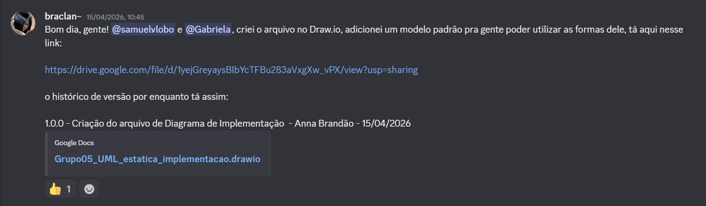
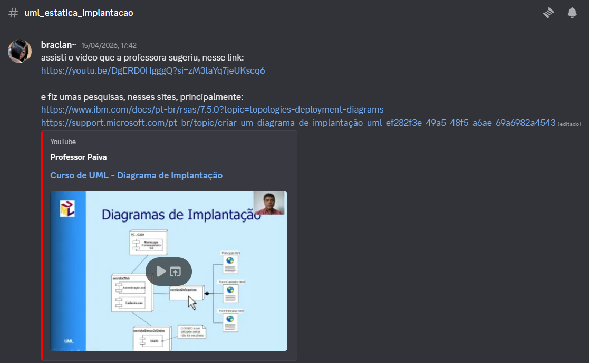
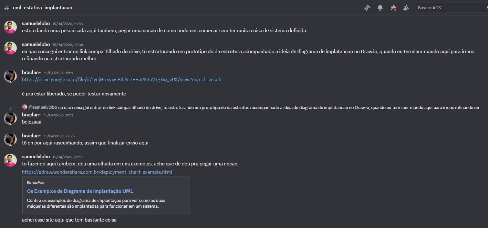
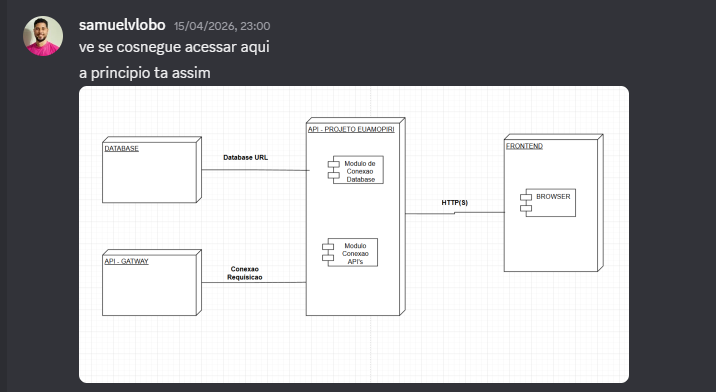
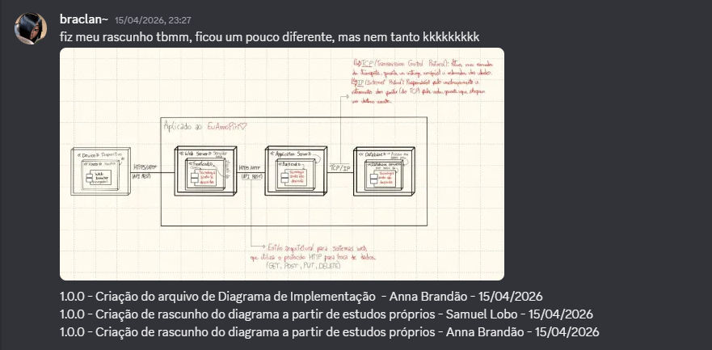
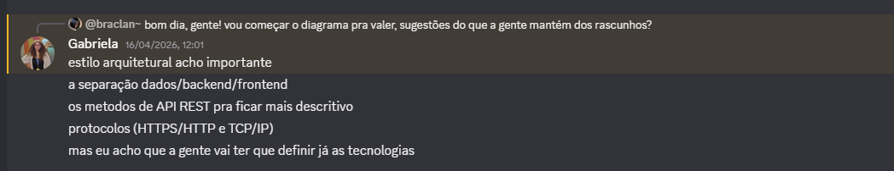
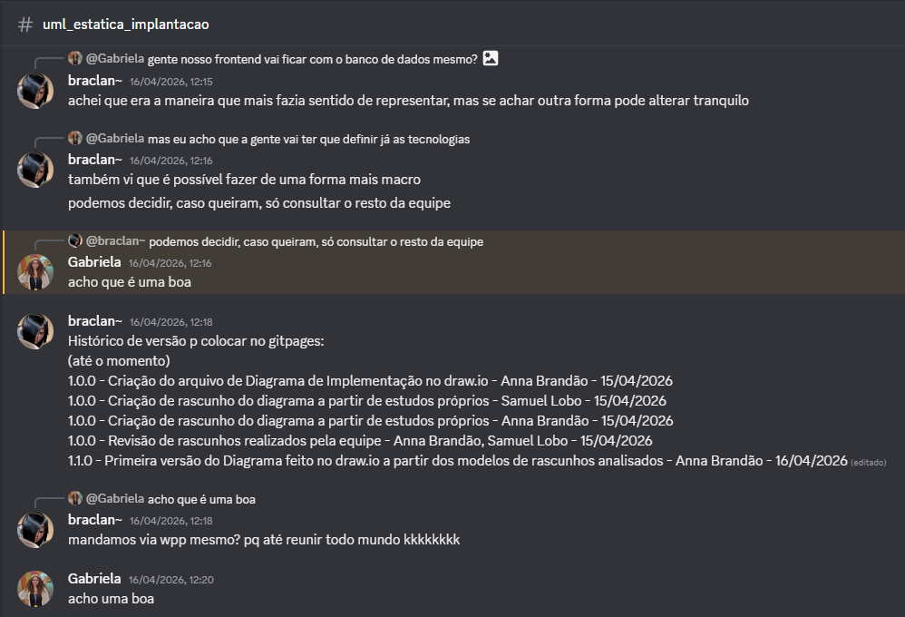
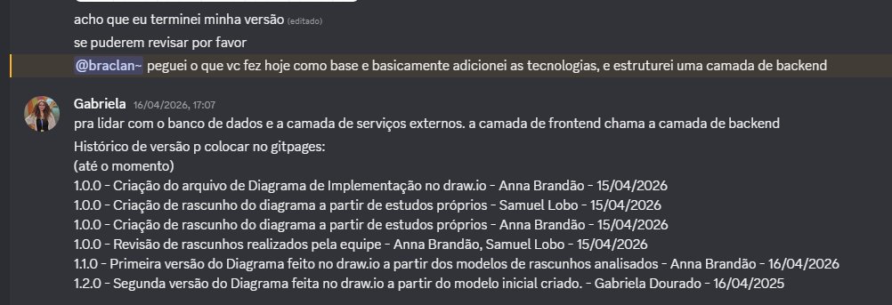
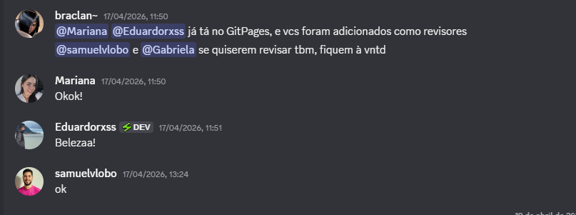

# 2.1.2 Diagrama de Implantação - EuAmoPiri

---

## Introdução

Os diagramas de implementação da UML desempenham um papel fundamental na representação da arquitetura física de sistemas, especialmente em aplicações distribuídas como o projeto EuAmoPiri. Por meio desses diagramas, é possível visualizar como os componentes de software e hardware se relacionam, além de compreender como o processamento está distribuído entre os diferentes elementos do sistema (“Diagramas de Implementação”, [s.d.]).

---

## Metodologia

Para a construção deste diagrama, utilizamos a ferramenta **Draw.io** e seguimos as diretrizes da **Linguagem de Modelagem Unificada (UML)**.  Nossa abordagem focou em mapear a arquitetura planejada, identificando os principais nós e artefatos de software, bem como as relações e protocolos de comunicação entre eles.

Para a nossa comunicação, optamos por centralizar todas as discussões através do canal da equipe no **Discord**, por lá fomos alinhando o andamento de cada versão, e dando avisos para a revisão via GitHub, de forma totalmente assíncrona.

Para a construção deste diagrama foram alocadas 3 pessoas como executoras:

- [Anna Clara](https://github.com/annacbrandao) (braclan~);
- [Gabriela](https://github.com/gabrieladouradof) (Gabriela);
- [Samuel](https://github.com/Samuelvlobo) (samuelvlobo).

2 pessoas como revisoras oficiais:

- [Eduardo Ribeiro](https://github.com/EduardoRibeiroXavier) (Eduardorxss);
- [Mariana](https://github.com/Marianamrts) (Mariana).

E o restante da equipe ficou responsável por acompanhar a construção e opinar caso fosse necessário.

Pelo **Discord** realizamos o compartilhamento de cada link ou foto relevantes para o andamento da construção do Diagrama de Implantação. Abaixo constam algumas das evoluções constatadas por lá, como a criação do template utilizado no **Draw.io**:

Em seguida compartilhamos alguns links de estudos próprios e discutimos o início dos rascunhos. Tivemos uma certa dificuldade para iniciar pois a equipe ainda não tinha definido de forma definitiva as tecnologias a serem utilizadas no desenvolvimento do projeto:

Após estes estudos iniciais conseguimos iniciar os rascunhos:

Então passamos por alguns feedbacks e sugestões, como a decisão de definir as tecnologias utilizadas junto ao resto da equipe:

Assim, com toda essa construção inicial, conseguimos chegar na segunda e terceira versão (final) do diagrama no **Draw.io**:

Então solicitamos revisão do diagrama:

E por fim, as revisões começaram a ser feitas pelo GitHub, com o apoio dos revisores e dos executores:

Outras revisões e adições posteriores foram realizadas no sentido de complementar a documentação, também sendo comunicadas pelo mesmo canal do **Discord** e por solicitações de revisões no GitHub.

## Visão dos contribuidores na concepção do diagrama

- **Samuel:** No início da criação do diagrama de implantação, elaborei um esboço de como seria nosso projeto, utilizando as metodologias e regras de elaboração de um diagrama de implantação. Com o desenvolvimento da ideia dos colegas participantes em conjunto comigo, fomos refinando a visão de como o sistema deveria ser estruturado. Com isso, elaboramos três versões até chegar ao modelo que julgamos ideal.

- **Anna:** A elaboração de rascunhos antes dos diagramas costuma ser uma coisa que tem me auxiliado, utilizei para este diagrama a mesma abordagem para o **Mapa Mental** que fiz anteriormente com o [Samuel](https://github.com/Samuelvlobo), na [Entrega 01](https://github.com/UnBArqDsw2026-1-Turma02/2026.01-T02_G5_EuAmoPiri_Entrega_01/blob/main/docs/Base/ArtefatosGeneralistas/1.2.3.mapaMental.md). Após estudar os materiais disponibilizados pela professora e outros auxiliares (presentes nas Referências Bibliográficas), consegui chegar no primeiro rascunho e tive uma visão mais clara de como prosseguir com o diagrama no **Draw.io**, dessa forma desenvolvi a primeira versão do mesmo. Com a experiência de ter desenvolvido a primeira versão somado com os estudos dos materiais, pude ajudar na revisão das outras versões desenvolvidas pela equipe.

---

## Diagrama de Implantação

O Diagrama de Implantação - EuAmoPiri em sua versão final:

![Diagrama de Implantação - EuAmoPiri][Diagrama-final]

## Análise e Resultados

Abaixo, listamos toda a arquitetura pensada e contruída e suas respectivas descrições.

### Dispositivo de Acesso

O acesso ao sistema é realizado por meio de um **navegador web (Web Browser)** rodando no dispositivo do usuário (`<<Device>>`).
O navegador é o ponto de entrada da aplicação, responsável por fazer as requisições iniciais e renderizar a interface do usuário.

Dentro desse nó temos:

* **Desktop (Web Browser)**: representa usuários acessando o sistema por computadores.
* **Mobile (Web Browser)**: representa usuários acessando via dispositivos móveis.

Ambos se comunicam com o servidor web utilizando o protocolo **TCP/IP**, que é a base da comunicação na internet.

### Servidor Web (Frontend)

O `<<Web Server>>` é responsável por hospedar a interface da aplicação, implementada no nó `<<Frontend>>`.

* Utiliza tecnologias como **React, TypeScript e Tailwind**, almejando uma aplicação moderna baseada em SPA (Single Page Application).
* Possui um **Módulo de Conexão com APIs**, responsável por consumir os dados do backend via requisições **HTTPS/REST**.

Esse servidor não possui lógica de negócio complexa, ele atua principalmente na **apresentação e interação com o usuário**.

### Servidor de Aplicação (Backend)

O `<<Application Server>>` contém a lógica principal do sistema, sendo o núcleo da aplicação.

Dentro dele temos:

* `<<Backend>>`: camada onde a aplicação está implementada.
* **API EuAmoPiri**: responsável por expor os serviços da aplicação.
* **Módulo de Conexão com Database**: gerencia a comunicação com o banco de dados.
* **Módulo de Conexão com APIs**: permite integração com serviços externos.
* Tecnologia utilizada: **Python**.

Esse servidor recebe requisições do frontend via **HTTPS/REST**, processa regras de negócio e retorna respostas.

### Banco de Dados

O `<<Database>>` representa a camada de persistência do sistema.

* `<<Database Server>>`: servidor onde o banco está hospedado.
* **Banco de Dados PostgreSQL**: utilizado para armazenar os dados da aplicação.

A comunicação entre o backend e o banco ocorre via **HTTPS**, garantindo segurança na troca de informações.

### API Gateway

O `<<API Gateway>>` atua como intermediário entre o backend e serviços externos.

* Contém **Serviços Externos**, que podem incluir APIs de terceiros (pagamentos, autenticação, etc.).
* Centraliza o acesso externo, ajudando em:

  * Segurança
  * Controle de requisições
  * Padronização de comunicação

A comunicação com o backend ocorre via **HTTP/REST**.

### Comunicação entre os Componentes

O sistema utiliza diferentes protocolos para comunicação:

* **TCP/IP**: entre usuário e frontend.
* **HTTPS/REST**: entre frontend e backend.
* **HTTPS**: entre backend e banco de dados.
* **HTTP/REST**: entre backend e API Gateway.

Essa separação foi escolhida para garantir:

* Segurança (uso de HTTPS)
* Escalabilidade
* Organização em camadas

---

### Link para o Draw.io

Clique [aqui](https://drive.google.com/file/d/1yejGreyaysBIbYcTFBu283aVxgXw_vPX/view?usp=sharing) para acessar o diagrama desenvolvido pela equipe.

### Rascunhos

Logo abaixo encontram-se os rascunhos feitos a partir de estudos próprios acerca do Diagrama.

1) **Rascunho feito por [Samuel](https://github.com/Samuelvlobo):**
(“UML deployment diagrams overview, common types of deployment diagrams - manifestation diagram, specification and instance level deployment diagram.”, [s.d.])

![Rascunho de Diagrama - Samuel][Rascunho-Samuel]

2) **Rascunho feito por [Anna Clara](https://github.com/annacbrandao):**
(“Criar um diagrama de implantação UML - Suporte da Microsoft”, [s.d.])

![Rascunho de Diagrama - Anna Clara][Rascunho-Anna]

### Versões no Draw.io

Esta seção possui as versões que a equipe chegou ao construir o Diagrama, até enfim chegar na versão final.

1) **Versão 1 feita por [Anna Clara](https://github.com/annacbrandao):**
(“Exemplos de Diagrama de Implantação UML”, 2026)

![Versão 1 do Diagrama - Anna Clara][v1-Anna]

2) **Versão 2 feita por [Gabriela](https://github.com/gabrieladouradof):**
(“Exemplos de Diagrama de Implantação UML”, 2026)

![Versão 2 do Diagrama - Gabriela][v2-Gabriela]

3) **Versão 3 feita por [Samuel](https://github.com/Samuelvlobo):**
(“UML deployment diagrams overview, common types of deployment diagrams - manifestation diagram, specification and instance level deployment diagram.”, [s.d.])

![Versão 3 do Diagrama - Samuel][v3-Samuel]

**A versão escolhida como a final foi a versão 3 do Diagrama.**

## Referências Bibliográficas

- **Exemplos de Diagrama de Implantação UML.** Disponível em: <https://edraw.wondershare.com.br/deployment-chart-example.html>. Acesso em: 15 abr. 2026.
- **Criar um diagrama de implantação UML - Suporte da Microsoft.** Disponível em: <https://support.microsoft.com/pt-br/topic/criar-um-diagrama-de-implanta%C3%A7%C3%A3o-uml-ef282f3e-49a5-48f5-a6ae-69a6982a4543>. Acesso em 15 abr. 2026.
- **Curso de UML - Diagrama de Implantação.** Disponível em: <https://youtu.be/DgERD0HgggQ?si=zM3laYq7jeUKscq6>. Acesso em: 15 abr. 2026.
- **Diagramas de Implementação.** Disponível em: <https://www.ibm.com/docs/pt-br/rsas/7.5.0?topic=topologies-deployment-diagrams>. Acesso em: 15/04/2026.
- **UML deployment diagrams overview, common types of deployment diagrams - manifestation diagram, specification and instance level deployment diagram.** Disponível em: <https://www.uml-diagrams.org/deployment-diagrams-overview.html>. Acesso em: 15 abr. 2026.
- **OMG®  Unified Modeling Language®.** OMG®  Unified Modeling Language®  (OMG UML® ). 5 dez. 2017. Disponível em: <https://www.omg.org/spec/UML/2.5.1/PDF> Acesso em: 16/04/2026.

## Histórico de Versão do Artefato

| Versão | Data | Descrição | Autor(es) | Revisor(es) |
| :----: | :--: | :-------: | :-------: | :---------: |
| 1.0.0 | 15/04/2026 | Criação do arquivo de Diagrama de Implementação no draw.io (link enviado no canal do grupo no Discord). | [Anna Clara](https://github.com/annacbrandao) | - |
| 1.0.0 | 15/04/2026 | Criação de rascunho do diagrama a partir de estudos próprios (rascunho enviado no canal do grupo no Discord). | [Samuel](https://github.com/Samuelvlobo) | [Anna Clara](https://github.com/annacbrandao), [Gabriela](https://github.com/gabrieladouradof) |
| 1.0.0 | 15/04/2026 | Criação de rascunho do diagrama a partir de estudos próprios (rascunho enviado no canal do grupo no Discord). | [Anna Clara](https://github.com/annacbrandao) | [Samuel](https://github.com/Samuelvlobo), [Gabriela](https://github.com/gabrieladouradof) |
| 1.0.0 | 15/04/2026 | Revisão de rascunhos realizados pela equipe via conversas no canal do grupo no Discord. | [Anna Clara](https://github.com/annacbrandao), [Samuel](https://github.com/Samuelvlobo) | - |
| 1.1.0 | 16/04/2026 | Primeira versão do Diagrama feito no draw.io a partir dos modelos de rascunhos analisados. | [Anna Clara](https://github.com/annacbrandao) | [Samuel](https://github.com/Samuelvlobo), [Gabriela](https://github.com/gabrieladouradof) |
| 1.2.0 | 16/04/2026 | Segunda versão do Diagrama feita no draw.io a partir do modelo inicial criado. | [Gabriela](https://github.com/gabrieladouradof) | [Anna Clara](https://github.com/annacbrandao), [Samuel](https://github.com/Samuelvlobo) |
| 1.3.0 | 16/04/2026 | Terceira/final versão do Diagrama feita no Draw.io a partir de versões anteriores. | [Samuel](https://github.com/Samuelvlobo) | [Anna Clara](https://github.com/annacbrandao), [Gabriela](https://github.com/gabrieladouradof) |
| 1.3.1 | 16/04/2026 | Correção e ajustes finais da versão final do Diagrama. | [Gabriela](https://github.com/gabrieladouradof) | [Mariana](https://github.com/Marianamrts), [Anna Clara](https://github.com/annacbrandao), [Samuel](https://github.com/Samuelvlobo) |

## Histórico do documento

| Versão | Data | Descrição | Autor(es) | Revisor(es) |
| :----: | :--: | :-------: | :-------: | :---------: |
| 1.1.0 | 16/04/2026 | Criação da documentação do Diagrama para o gitpages, com adição de conteúdos iniciais (Intodução, Metodologia, Histórico de Versão). | [Anna Clara](https://github.com/annacbrandao) | - |
| 1.2.0 | 17/04/2026 | Adição de conteúdo revisado e complementar no GitPages, contendo as contribuições e resultados alcançados. | [Anna Clara](https://github.com/annacbrandao) | [Mariana](https://github.com/Marianamrts) |
| 1.2.1 | 22/04/2026 | Correção do histórico de versão e padronização da estrutura da documentação. | [Anna Clara](https://github.com/annacbrandao) | [Mariana](https://github.com/Marianamrts), [Eduardo Ribeiro](https://github.com/EduardoRibeiroXavier) |
| 1.2.2 | 22/04/2026 | Adição de visão de contribuidor. | [Samuel](https://github.com/Samuelvlobo) | [Anna Clara](https://github.com/annacbrandao) |
| 1.2.2 | 22/04/2026 | Adição de visão de contribuidora e referências utilizadas para o desenvolvimento do diagrama. | [Anna Clara](https://github.com/annacbrandao) | [Mariana](https://github.com/Marianamrts), [Eduardo Ribeiro](https://github.com/EduardoRibeiroXavier), [Samuel](https://github.com/Samuelvlobo) |
| 1.2.3 | 22/04/2026 | Adição de rastreabilidade de mensagens via Discord e adição de citações de referências no texto. | [Anna Clara](https://github.com/annacbrandao) | [Samuel](https://github.com/Samuelvlobo) |

[Diagrama-final]: ./imagens/DiagramaImplantacao-Final.png
[Rascunho-Samuel]: ./imagens/DiagramaImplantacao-RascunhoSamuel.png
[Rascunho-Anna]: ./imagens/DiagramaImplantacao-RascunhoAnna.jpg
[v1-Anna]: ./imagens/DiagramaImplantacao-v1Anna.png
[v2-Gabriela]: ./imagens/DiagramaImplantacao-v2Gabriela.png
[v3-Samuel]: ./imagens/DiagramaImplantacao-v3Samuel.png
