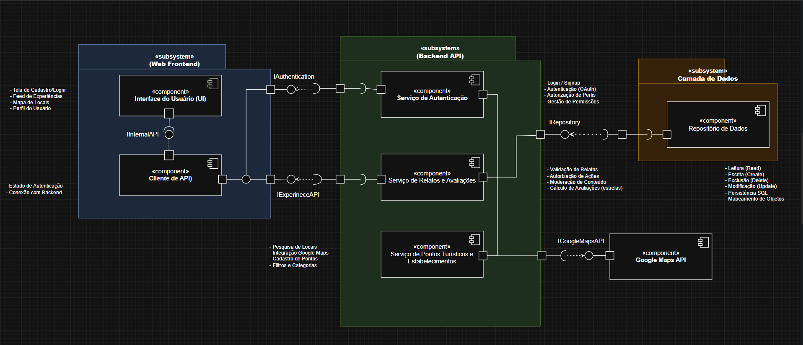

# 2.1.3 Diagrama de Componentes

## Introdução

O **Diagrama de Componentes** da UML descreve a organização modular do sistema: partes com conteúdo encapsulado, potencialmente substituíveis no seu ambiente, cujo comportamento é definido em termos de **interfaces providas** e **interfaces requeridas** (por exemplo, expostas por **portas** e conectadas por **conectores**). A notação habitual representa o componente como classificador com a palavra-chave «component» (ou o ícone de componente), as interfaces providas em forma de “pirulito” e as requeridas em forma de “tomada”, favorecendo a visão externa em “caixa-preta” do sistema.

Referência [UML Component (uml-diagrams.org)](https://www.uml-diagrams.org/component.html).

## Objetivo

Documentar, para o projeto **EuAmoPiri**, a arquitetura lógica em componentes e subsistemas que suporta o compartilhamento de experiências sobre Pirenópolis: interface com o utilizador, consumo de APIs de negócio, serviços de autenticação, de relatos e avaliações, de pontos turísticos e estabelecimentos (com integração cartográfica), e persistência via repositório. O objetivo é explicitar **dependências entre módulos** por interfaces, orientando implementação, testes e evolução independente de cada parte.

## Evolução do artefato

### Versão 1.0.0 — rascunho (13/04/2026)

Primeira versão do diagrama de componentes, definindo subsistemas e componentes principais e iniciando o desenho das relações entre frontend, backend e dados.

### Versão 1.0.0 — revisão e direcionamentos (14/04/2026)

Análise do rascunho com foco em nomenclaturas, interfaces e termos.

### Versão 1.1.0 (15/04/2026)

Elaboração de uma segunda versão do diagrama com correção da **notação** dos elementos, aproximando o modelo do detalhe de implementação e especificando sobretudo relações **provide** e **require** envolvendo o serviço de locais (pontos turísticos e estabelecimentos).

### Versão 1.2.0 (16/04/2026)

Correção de requerimentos, acréscimo de um componente e ajustes para tornar o diagrama mais **completo** e coerente com o restante desenho do sistema.

### Versão final (1.2.1) — 18/04/2026

Análise final: melhor organização dos **conectores**, padronização do tamanho dos componentes e **um único** diagrama consolidado. A figura seguinte corresponde a esta versão.

Subsistemas e interfaces principais representados:

- **Subsistema Frontend Web**: componentes *Interface do Usuário* e *Cliente de API*, ligados internamente por *InternalAPI*;
- **Subsistema API Backend**: *Serviço de Autenticação*, *Serviço de Relatos e Avaliações* e *Serviço de Pontos Turísticos e Estabelecimentos*; o *Cliente de API* **provê** o *IAuthentication* (requerido pelo serviço de autenticação) e *IExperienceAPI* (requerida pelo serviço de relatos e avaliações).
- **Subsistema Camada de Dados**: *Repositório de Dados*, que **requer  ** *IRepository*; os três serviços de backend **proveem** *IRepository*.
- **Google Maps API** (externo): **provê** *IGoogleMapsAPI*, **requerida** pelo *Serviço de Pontos Turísticos e Estabelecimentos*.

## Visão dos contribuidores na concepção do diagrama

**Letícia Paiva:** o rascunho inicial ajudou a equipe a alinhar quais “caixas” do sistema existiam antes de fechar contratos; 

**Mariana Martins Silva:** a versão 1.2.0 foi o momento de corrigir **requerimentos** faltantes ou ambíguos e incluir o componente que faltava para o modelo refletir o fluxo real de dados e integrações.

**Amanda De Moura:** nas revisões 1.0.0–1.2.1 o foco foi analisar de provide/require, em especial no serviço de locais, e fechar o diagrama com padronizado,  com os conectores organizados.

## Referências

> FAKHROUTDINOV, Kirill. UML 2.5 Component Diagrams: **Component**. uml-diagrams.org. [Acessado em: 18 Abr. 2026](https://www.uml-diagrams.org/component.html)

Material da disciplina **Arquitetura e Desenho de Software** (UnB): apostila UML; módulo 3 — UML; aula *Modelagem UML Estática* (Profa. Milene). 

## Histórico do artefato

| Data       | Versão | Descrição                                                                                                                                           | Autor                 | Revisores |
| ---------- | ------ | ----------------------------------------------------------------------------------------------------------------------------------------------------- | --------------------- | --------- |
| 13/04/2026 | 1.0.0  | Criação do rascunho do diagrama de componentes                                                                                                       | Letícia Paiva         | [Milena Marques](https://github.com/milenamso)   & [Gabriela Dourado](https://github.com/gabrieladouradof) & [Davi Egito](https://github.com/daviegito)  |
| 14/04/2026 | 1.0.0  | Análise do rascunho, com direcionamentos para evoluções e melhorias em nomenclaturas, interfaces, termos e diagramação em mais baixo nível             | Amanda De Moura       |  [Milena Marques](https://github.com/milenamso)   & [Gabriela Dourado](https://github.com/gabrieladouradof) & [Davi Egito](https://github.com/daviegito)   |
| 15/04/2026 | 1.1.0  | Implementação de uma v2 com correção da notação, aproximando o baixo nível; destaque às relações provide/require no serviço de locais                    | Amanda De Moura       | [Milena Marques](https://github.com/milenamso)   & [Gabriela Dourado](https://github.com/gabrieladouradof) & [Davi Egito](https://github.com/daviegito) |
| 16/04/2026 | 1.2.0  | Correção de requerimentos, acréscimo de componente e diagrama mais completo e lógico                                                                   | Mariana Martins Silva | [Milena Marques](https://github.com/milenamso)   & [Gabriela Dourado](https://github.com/gabrieladouradof) & [Davi Egito](https://github.com/daviegito)     |
| 18/04/2026 | 1.2.1  | Análise final: organização dos conectores, padronização do tamanho dos componentes e remoção do segundo diagrama                                     | Amanda De Moura       | [Milena Marques](https://github.com/milenamso)   & [Gabriela Dourado](https://github.com/gabrieladouradof) & [Davi Egito](https://github.com/daviegito) |

## Histórico do documento

| Data       | Versão | Descrição                                                                 | Autor           | Revisores |
| ---------- | ------ | ------------------------------------------------------------------------- | --------------- | --------- |
| 18/04/2026 | 1.0.0  | Criação da documentação | Amanda De Moura | [Mariana Martins](https://github.com/Marianamrts)   & [Letícia Paiva](https://github.com/leticiakrpaiva) |
