# 2.1.3 Diagrama de Componentes

## Introdução

O **Diagrama de Componentes** da UML descreve a organização modular do sistema: partes com conteúdo encapsulado, potencialmente substituíveis no seu ambiente, cujo comportamento é definido em termos de **interfaces providas** e **interfaces requeridas** (por exemplo, expostas por **portas** e conectadas por **conectores**). A notação habitual representa o componente como classificador com a palavra-chave «component» (ou o ícone de componente), as interfaces providas em forma de “pirulito” e as requeridas em forma de “tomada”, favorecendo a visão externa em “caixa-preta” do sistema.

Referência [UML Component (uml-diagrams.org)](https://www.uml-diagrams.org/component.html).

## Objetivo

Documentar, para o projeto **EuAmoPiri**, a arquitetura lógica em componentes e subsistemas que suporta o compartilhamento de experiências sobre Pirenópolis: interface com o utilizador, consumo de APIs de negócio, serviços de autenticação, de relatos e avaliações, de pontos turísticos e estabelecimentos (com integração cartográfica), e persistência via repositório. O objetivo é explicitar **dependências entre módulos** por interfaces, orientando implementação, testes e evolução independente de cada parte.

## Metodologia

Letícia Paiva (letwasz), Mariana Martins Silva e Amanda De Moura utilizaram o **Discord** (canal dedicado ao artefato de componentes) para a confecção e refinamento do diagrama. A comunicação foi predominantemente **assíncrona**, porém frequente: cada proposta de rascunho, dúvida de notação ou ajuste de conectores era compartilhada para que o grupo pudesse refletir, alinhar com o material da disciplina e evoluir o modelo de forma coletiva.

Para **revisão**, aguardamos comentários dos colegas que se dispuseram a revisar o diagrama: **Davi Egito** (DaviMEC), **Gabriela Dourado** e **Milena Marques** (milenamso), também de forma assíncrona no Discord. Os prints das principais discussões e dos feedbacks estão referenciados nas secções seguintes, em ordem cronológica aproximada do fluxo de trabalho.

## Discussões no Discord (evolução do artefato)

As imagens abaixo documentam o fio condutor das decisões, da abertura do trabalho até o alinhamento sobre notação e estrutura do diagrama.

1. **Início do artefato e registro de versão** — Amanda compartilha links do diagrama (Google Drive e draw.io) e inicia o registro de histórico; a primeira entrada documentada é a criação do rascunho por Letícia (13/04/2026). Letícia complementa com o link da videoaula da professora, utilizada como referência principal pelo grupo.

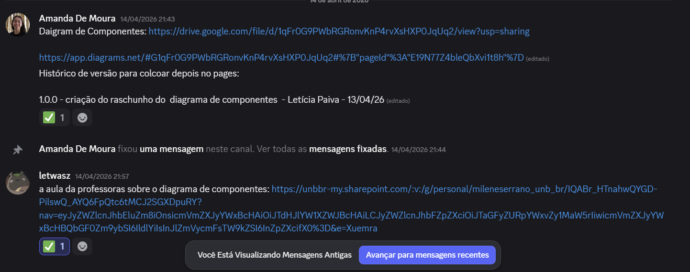

2. **Apresentação do primeiro rascunho (camadas)** — Letícia explica a escolha de separar **Interface do Usuário** e **Cliente de API** na camada de apresentação, e serviços de negócio alinhados ao fluxo BPMN (autenticação, locais, experiências), com ligações iniciais à camada de dados.

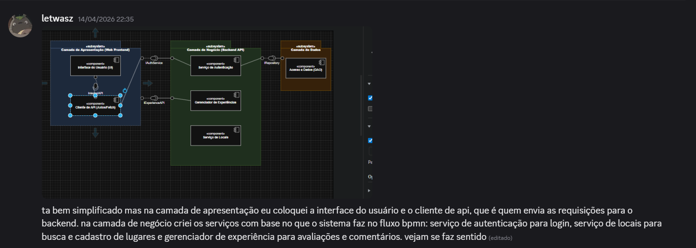

3. **Revisão do rascunho com anotações** — Amanda registra feedback visual (anotações em vermelho) sobre aprofundar funcionalidades na UI, relação com visão MVC, distinção autenticação/autorização, operações de persistência (CRUD) e coerência das ligações com `IRepository`.

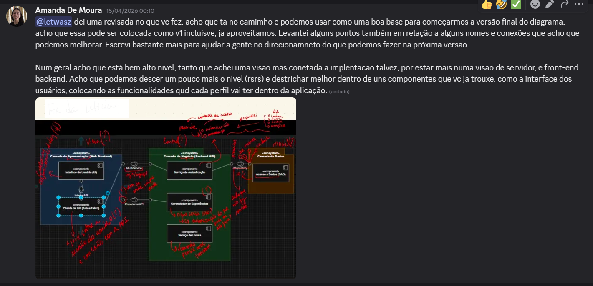

4. **Portas do serviço de autenticação** — Debate entre Amanda e Letícia sobre modelar login/cadastro como portas separadas ou como **funções internas** de um único ponto de acesso ao serviço; consenso em **uma porta/interface** para o serviço de autenticação como um todo, em vez de fragmentar cada operação.

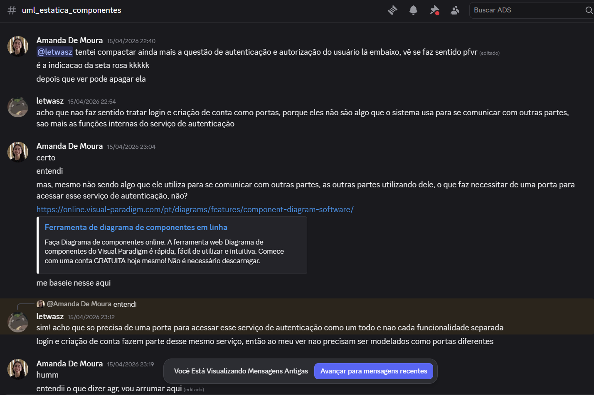

5. **Camada de dados e Google Maps** — Mariana questiona a necessidade de ambos os serviços (experiências e locais) dependerem da camada de dados; Letícia confirma. Sobre o Google Maps, acorda-se representá-lo como **componente externo** ligado ao serviço de locais, por consumo de API, em vez de subsistema interno.

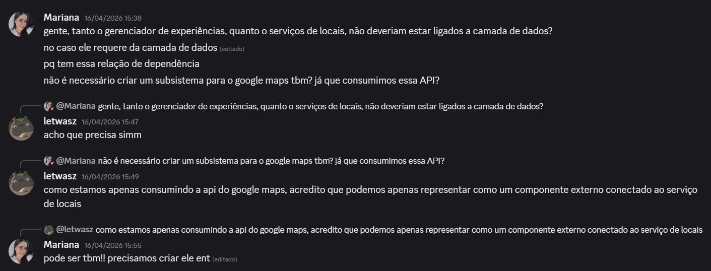

6. **Tipo de linha e integração externa** — Mariana pede opinião sobre linhas tracejadas vs. contínuas nas relações de requerimento; após troca com Amanda (e contexto da Letícia sobre Maps), Mariana **padroniza linhas contínuas** onde fazia sentido para a leitura do grupo. Fica registrado o matiz de cadastro de local por morador, além do consumo do mapa.

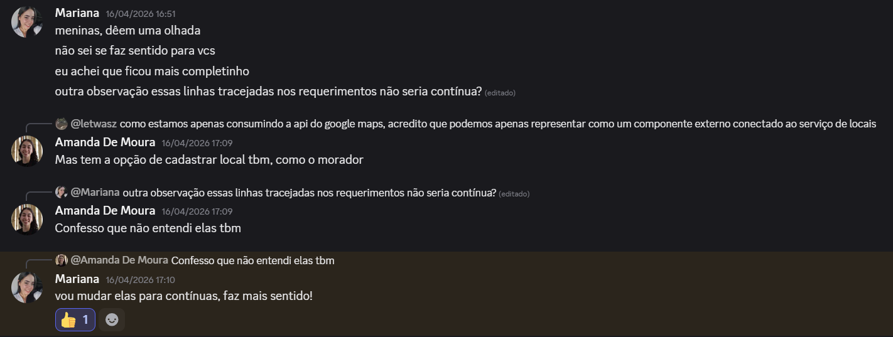

7. **Padronização gráfica dos “pirulitos”** — Davi aponta inconsistência visual: interfaces providas com formato **elíptico** em vez de **circulares**; o grupo acorda corrigir para evitar penalização na correção e manter notação uniforme.

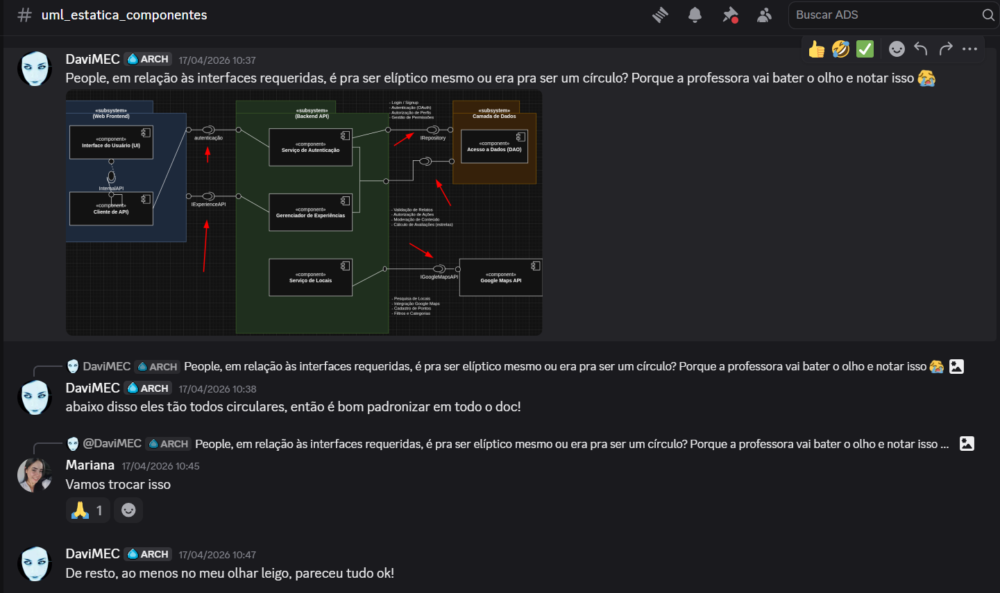

8. **Dependências e visão de componente (pós-aula)** — Amanda e Mariana alinham após aula sobre componentes, refinando os **conectores de dependência/requerimento** e a intenção de **consolidar um único diagrama** final, em vez de versões paralelas desconexas.

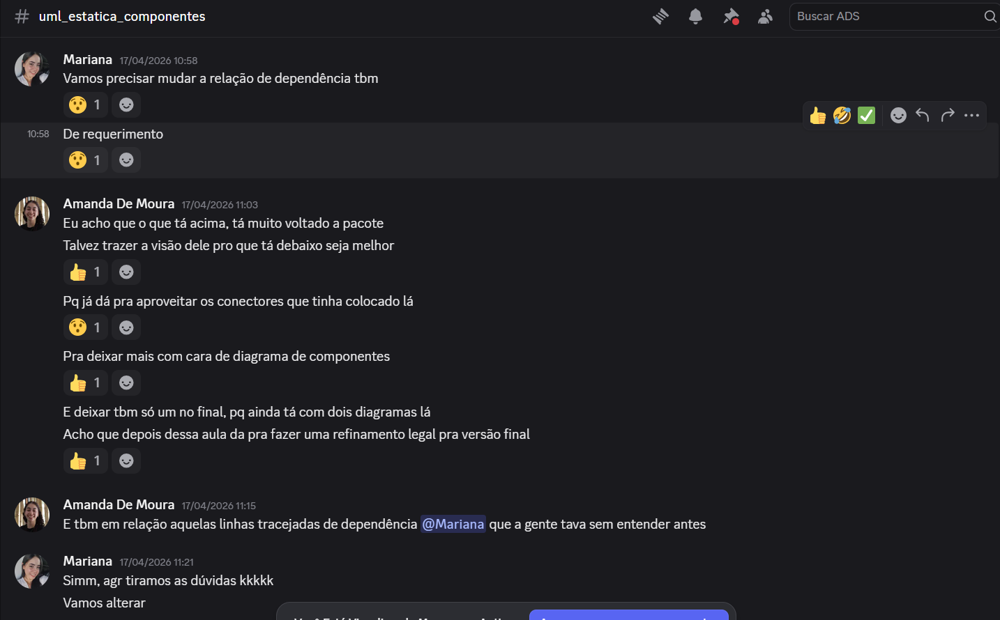

## Feedbacks dos revisores

Além das mensagens já integradas ao fio das [Discussões no Discord](#discussões-no-discord-evolução-do-artefato) (em especial o **item 7**, com o print da revisão do Davi), os registos abaixo destacam feedbacks dos revisores.

**Davi Egito** — Padronização das interfaces providas (**círculos** em vez de formas elípticas) e visão geral positiva do restante do artefato após o ajuste (vide **item 7** nas discussões e respetiva imagem).

**Gabriela Dourado** — Reconhecimento do uso de templates UML; elogio à nomeação de interfaces com prefixo **`I`**, citando `IGoogleMapsAPI` como exemplo intuitivo de contrato.

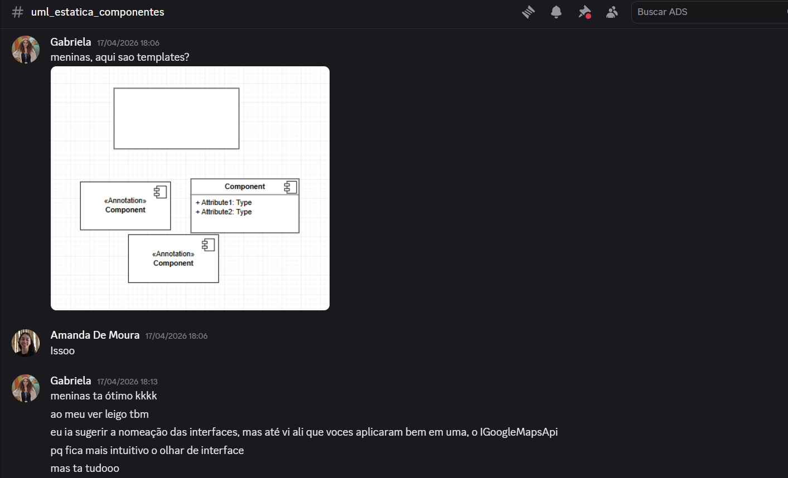

**Milena Marques** — Identificação de **interface/conector pendente** no subsistema de relatos em relação ao frontend; Mariana assume o ajuste para fechar o fluxo de comunicação de forma coerente.

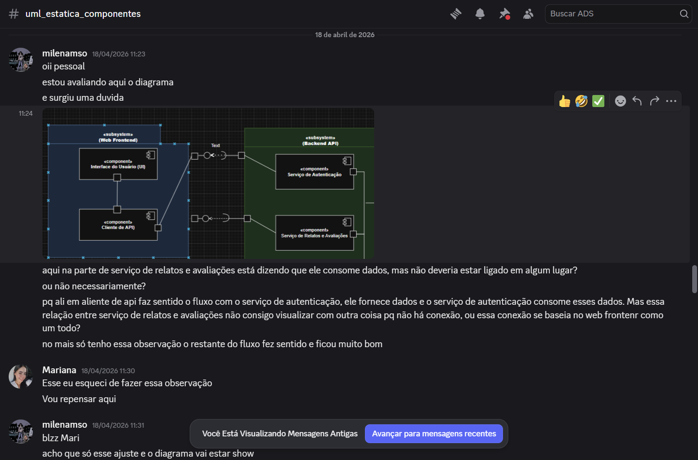

## Evolução do artefato

A sequência de figuras abaixo acompanha a linha visual principal acordada pelo grupo — **do rascunho inicial à versão final** — e **correlaciona-se ao [Histórico do artefato](#histórico-do-artefato)** (versões `1.0.0` a `1.2.1`)

### Figura 1 — Rascunho inicial

**Correlação com o histórico:** `1.0.0` — **13/04/2026** — criação do rascunho (Letícia Paiva).

Primeira materialização em três grandes blocos (apresentação, negócio, dados), com **Interface do Usuário**, **Cliente de API**, serviços de **Autenticação**, **Gerenciador de Experiências** e **Serviço de Locais**, e **Acesso a Dados (DAO)**, já com interfaces `IAuthService`, `IExperienceAPI` e `IRepository` esboçadas entre camadas.

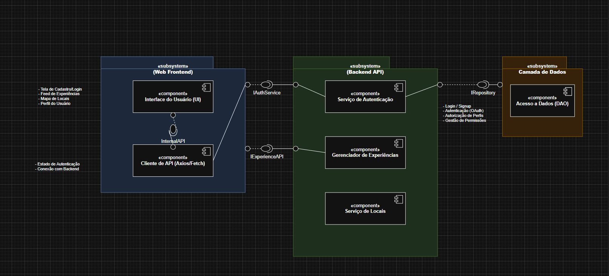

**Letícia Paiva:** no processo de criação do primeiro rascunho, parti das decisões que já tínhamos sobre o funcionamento do sistema e extraí principalmente informações da modelagem **BPMN**, o que ajudou a ter uma noção inicial de como separar em **camadas**. A partir disso, tentei organizar as principais partes do sistema e agrupar várias ações relacionadas para identificar um **componente**. Além disso, a **videoaula da professora** contribuiu bastante para entender melhor a estruturação do diagrama e orientar a construção do primeiro rascunho.

### Figura 2 — Versão Adaptada (exploratória)

**Correlação com o histórico:** momento ligado à **análise e direcionamentos** de **14/04/2026** (`1.0.0`, Amanda De Moura) e à discussão de **aprofundamento** do modelo; trata-se de uma **variante de organização** produzida para experimentar o alinhamento com exemplos de slides/aula, **sem substituir** o rascunho da Letícia como base principal da evolução.

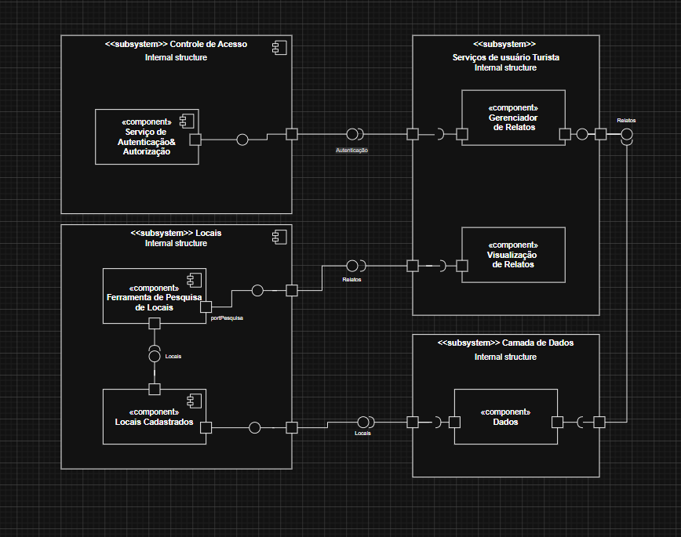

**Amanda De Moura:** a partir do que a Letícia trouxe, fiquei instigada a deixar o mais parecido com os exemplos que já tinha visto nos **slides**, então comecei criando uma **versão adaptada** do diagrama-rascunho que ela tinha trazido, para demonstrar como poderia ser organizado. Essa versão **não ficou tão boa** para visualizar os componentes do sistema; logo a escolhida foi a **inicial**, e a partir de um **feedback positivo da professora**, entendi que estávamos no **caminho correto**.

### Figura 3 — Versão após correções estruturais

**Correlação com o histórico:** `1.2.0` — **16/04/2026** — correção de requerimentos, acréscimo de componente e diagrama mais completo (Mariana Martins Silva).

Inclui ajustes de **requerimentos** e de **fronteiras** entre subsistemas, integração da **API do Google Maps** como componente **externo**, e maior coerência com o desenho geral do sistema e as discussões sobre dependência da **camada de dados** pelos serviços de negócio.

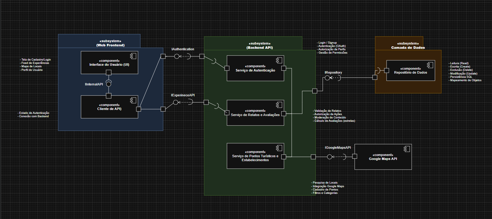

**Mariana Martins Silva:** na finalização da criação do diagrama de componentes, foi essencial ter uma noção básica de como **cada componente se relacionava com o outro**; com isso, foi mais fácil abstrair as ideias necessárias para fazer os devidos **refinamentos** e as **correções** de portas, ligações e componentes.

### Figura 4 — Versão final

**Correlação com o histórico:** `1.2.1` — **18/04/2026** — análise final: organização dos conectores, padronização do tamanho dos componentes e consolidação em **um único** diagrama (Amanda De Moura).

**Amanda De Moura:** após a aula de diagrama de componentes, a Mariana já tinha conseguido melhorar os pontos de erro que tínhamos em relação aos **conectores**, às suas **fronteiras** e aos **tipos de linhas** nas relações de dependência; busquei **revisar e organizar** melhor as conexões. Vi que ainda havia uma parte no subsistema **Web Frontend** que podia ser **condensada** e melhorada em relação à interface de **provide**, e no subsistema **Backend API**, a organização dos conectores de **require** em relação ao subsistema Web Frontend.

**Subsistemas e interfaces principais** na versão final:

- **Web Frontend:** *Interface do Usuário* e *Cliente de API*, com ligação interna por interface de uso do cliente (por exemplo `IInternalAPI` / contrato interno entre UI e cliente HTTP).
- **Backend API:** *Serviço de Autenticação*, *Serviço de Relatos e Avaliações* e *Serviço de Pontos Turísticos e Estabelecimentos*; o *Cliente de API* **requer** interfaces providas pelo backend (por exemplo **`IAuthentication`** e **`IExperienceAPI`**), conforme portas no limite do subsistema.
- **Camada de Dados:** *Repositório de Dados* **provê** **`IRepository`**, **requerida** pelos serviços de backend que persistem ou consultam dados.
- **Google Maps API** (externo): **provê** **`IGoogleMapsAPI`**, **requerida** pelo *Serviço de Pontos Turísticos e Estabelecimentos*.

## Visão dos contribuidores na concepção do diagrama

**Letícia Paiva:** no processo de criação do primeiro rascunho do diagrama de componentes, parti das decisões que já tínhamos sobre o funcionamento do sistema e extraí principalmente informações da modelagem **BPMN**, o que ajudou a ter uma noção inicial de como separar em camadas. A partir disso, tentei organizar as principais partes do sistema e agrupar várias ações relacionadas para identificar um componente. Além disso, a videoaula da professora contribuiu bastante para entender melhor a estruturação do diagrama e orientar a construção do primeiro rascunho.

**Mariana Martins Silva:** na finalização da criação do diagrama de componentes foi essencial ter uma noção básica de entendimento sobre como cada componente se relacionava com o outro; com isso, foi mais fácil abstrair as ideias necessárias para fazer os devidos refinamentos e as correções necessárias de portas, ligações e componentes.

**Amanda De Moura:** foi um processo de criação com um nível de abstração inicialmente confuso para mim, pois tinha um viés grande de componentização por causa do React, mas após tirar algumas dúvidas com a professora e receber alguns feedbacks das meninas que executaram comigo, ficou mais claro enxergar e conseguir ter um melhor senso crítico para construir esse diagrama no nível do projeto que estamos hoje. Além disso,foi uma ótima experiência práticas para entender a relação de **requerir** e de **prover** uma interface dentre os componentes.

## Link para o Draw.io

Clique [aqui](https://drive.google.com/file/d/1qFr0G9PWbRGRonvKnP4rvXsHXP0JqUq2/view?usp=sharing) para acessar o diagrama no Google Drive (arquivo draw.io do grupo).

## Referências

> FAKHROUTDINOV, Kirill. UML 2.5 Component Diagrams: **Component**. uml-diagrams.org. [Acessado em: 18 Abr. 2026](https://www.uml-diagrams.org/component.html)

Material da disciplina **Arquitetura e Desenho de Software** (UnB): apostila UML; módulo 3 — UML; aula *Modelagem UML Estática* (Profa. Milene). 

## Histórico do artefato

| Data       | Versão | Descrição                                                                                                                                           | Autor                 | Revisores |
| ---------- | ------ | ----------------------------------------------------------------------------------------------------------------------------------------------------- | --------------------- | --------- |
| 13/04/2026 | 1.0.0  | Criação do rascunho do diagrama de componentes                                                                                                       | Letícia Paiva         | [Milena Marques](https://github.com/milenamso)   & [Gabriela Dourado](https://github.com/gabrieladouradof) & [Davi Egito](https://github.com/daviegito)  |
| 14/04/2026 | 1.0.0  | Análise do rascunho, com direcionamentos para evoluções e melhorias em nomenclaturas, interfaces, termos e diagramação em mais baixo nível             | Amanda De Moura       |  [Milena Marques](https://github.com/milenamso)   & [Gabriela Dourado](https://github.com/gabrieladouradof) & [Davi Egito](https://github.com/daviegito)   |
| 15/04/2026 | 1.1.0  | Implementação de uma v2 com correção da notação, aproximando o baixo nível; destaque às relações provide/require no serviço de locais                    | Amanda De Moura       | [Milena Marques](https://github.com/milenamso)   & [Gabriela Dourado](https://github.com/gabrieladouradof) & [Davi Egito](https://github.com/daviegito) |
| 16/04/2026 | 1.2.0  | Correção de requerimentos, acréscimo de componente e diagrama mais completo e lógico                                                                   | Mariana Martins Silva | [Milena Marques](https://github.com/milenamso)   & [Gabriela Dourado](https://github.com/gabrieladouradof) & [Davi Egito](https://github.com/daviegito)     |
| 18/04/2026 | 1.2.1  | Análise final: organização dos conectores, padronização do tamanho dos componentes e remoção diagrama adaptado                                      | Amanda De Moura       | [Milena Marques](https://github.com/milenamso)   & [Gabriela Dourado](https://github.com/gabrieladouradof) & [Davi Egito](https://github.com/daviegito) |

## Histórico do documento

| Data       | Versão | Descrição                                                                 | Autor           | Revisores |
| ---------- | ------ | ------------------------------------------------------------------------- | --------------- | --------- |
| 18/04/2026 | 1.0.0  | Criação da documentação | Amanda De Moura | [Mariana Martins](https://github.com/Marianamrts)   & [Letícia Paiva](https://github.com/leticiakrpaiva) |
| 23/04/2026 | 1.1.0  | Metodologia, discussões no Discord, feedbacks dos revisores, evolução do artefato alinhada às figuras v0 → alternativa → v1 → final e link do draw.io | Amanda De Moura | [Mariana Martins](https://github.com/Marianamrts) & [Letícia Paiva](https://github.com/leticiakrpaiva) |
