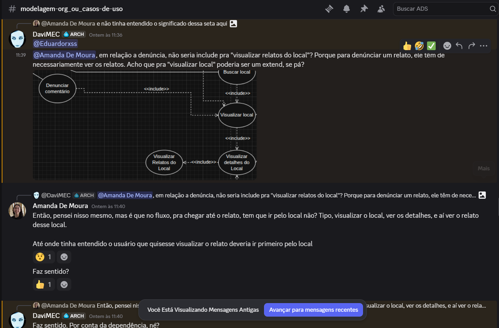
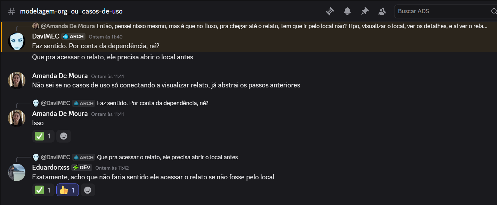
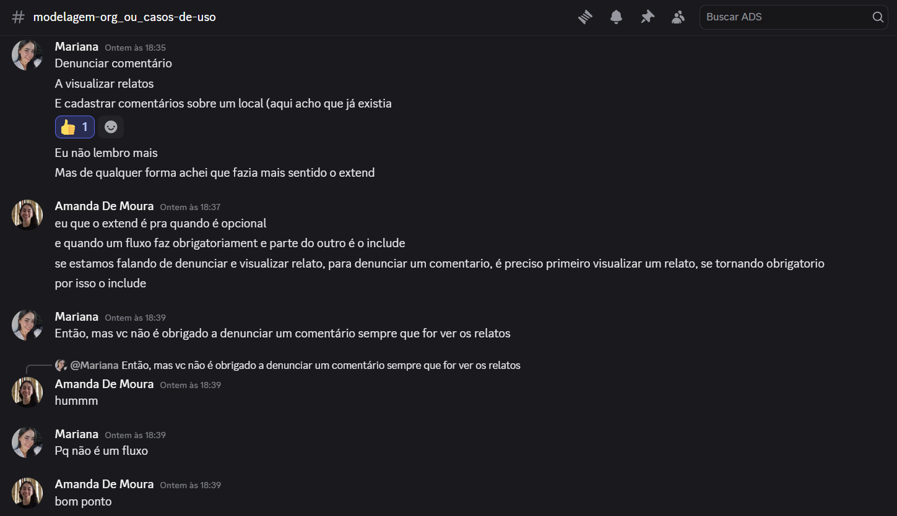
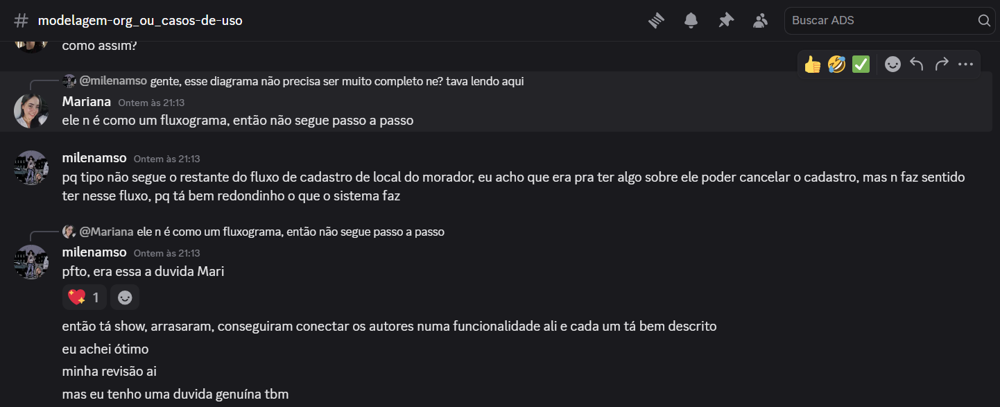
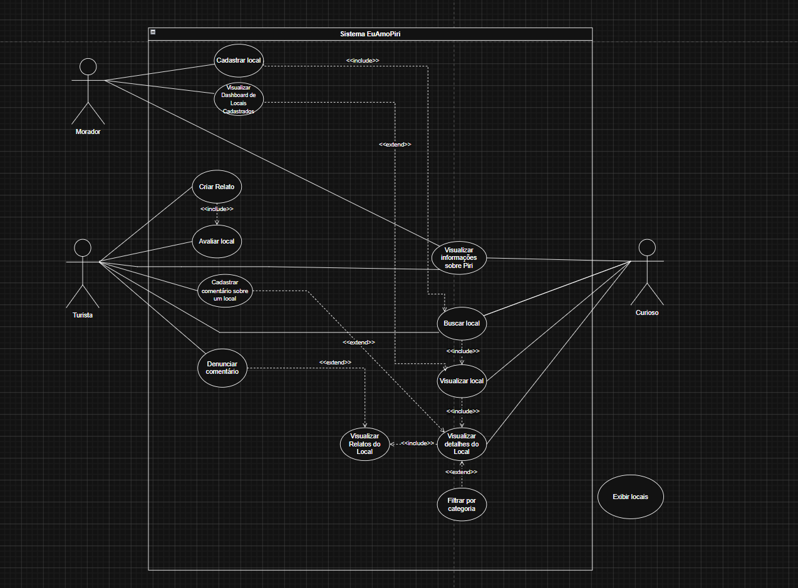

# 2.3.1 Casos de Uso

## Introdução

O diagrama de casos de uso, pertencente à UML, é uma técnica de modelagem utilizada para representar as funcionalidades de um sistema a partir da perspectiva dos usuários que interagem com ele. Esse tipo de diagrama permite identificar os serviços oferecidos pelo sistema, bem como os diferentes atores envolvidos e suas respectivas interações.

## Objetivo

O diagrama tem como finalidade apoiar a compreensão e validação dos requisitos funcionais, facilitando a comunicação entre os membros da equipe e demais stakeholders. Dessa forma, contribui para o alinhamento das expectativas e serve como base para as etapas posteriores do desenvolvimento do sistema.

## Metodologia

Para confecção deste artefato, usamos o Discord de maneira assíncrona, especialmente para discussão de alguns tópicos e para resolver problemas relativos à documentação.

*Figura 1 - Discussão assíncrona no Discord*

Fonte: Discord

A seguir, registramos, na ordem em que ocorreram no canal de modelagem, trechos das conversas que orientaram decisões sobre relacionamentos entre casos de uso (`<<include>>` / `<<extend>>`) e sobre o nível de detalhe do diagrama.

### Discussão 1 — dependência entre fluxo de local e relatos

Davi (DaviMEC) questionou se não faria sentido usar `<<include>>` entre denúncia e **Visualizar relatos do local**, argumentando que, para denunciar um relato, o usuário precisaria necessariamente ver os relatos; em paralelo, cogitou `<<extend>>` em relação a **Visualizar local**. Amanda (Amanda De Moura) respondeu que, no fluxo de navegação, para chegar ao relato é preciso passar pelo local (visualizar local, detalhes e, então, os relatos daquele local). Então, nós reconhecemos que há **dependência funcional** nessa cadeia de acesso.

*Figura 2: Discussão no Discord — dependência entre denúncia, local e relatos*

Fonte: Discord

### Discussão 2 — acesso ao relato sempre via local

Continuação do fio: Davi reforçou que, para acessar o relato, o usuário precisa abrir o local antes. Amanda questionou se, no diagrama de casos de uso, conectar apenas a **Visualizar relato** já não abstrairia os passos anteriores. Eduardo (Eduardorxss) concordou que não faria sentido acessar o relato sem passar pelo local. A conversa consolidou a ideia de que o acesso ao conteúdo de relato está ancorado ao contexto do local.

*Figura 3: Discussão no Discord — acesso ao relato via local*

Fonte: Discord

### Discussão 3 — extend versus include na denúncia de comentário

Mariana listou os casos **Denunciar comentário**, **Visualizar relatos** e **Cadastrar comentários sobre um local** e defendeu que `<<extend>>` era o mais adequado. Amanda explicou a distinção usual: `<<extend>>` para comportamento opcional e `<<include>>` para trecho obrigatório do fluxo, sugerindo `<<include>>` por ser necessário ver o relato antes de denunciar. Mariana contrapôs que o usuário **não é obrigado** a denunciar toda vez que visualiza relatos — não é um fluxo linear obrigatório. Amanda reconheceu o ponto. **Conclusão da modelagem:** tratar **Denunciar comentário** como extensão opcional do fluxo em que o usuário já está **visualizando relatos** (e não como inclusão obrigatória em toda execução de visualização).

*Figura 4: Discussão no Discord — extend e include na denúncia*

Fonte: Discord

### Feedback das revisoras

Aguardamos também o retorno assíncrono das revisoras **Milena** e **Anna** no Discord.

**Milena:** revisão positiva à organização do diagrama (atores bem conectados às funcionalidades e descrições claras). Surgiu a dúvida se o diagrama deveria detalhar passos como cancelar cadastro no mesmo nível do fluxo do morador; 

*Figura 5: Feedback da revisora Milena no Discord*

Fonte: Discord

**Anna:** na mensagem registrada na figura seguinte, a revisora Anna comunica que reviu o diagrama, que a **notação** parece correta e que os **fluxos** fazem sentido em relação ao que já tinha sido decidido para os **perfis** de usuário; manifesta apreciação pelo trabalho.

*Figura 6: Feedback da revisora Anna no Discord*

Fonte: Discord

## Evolução do Artefato

### Versão 1.0

*Figura 7 - Diagrama de Casos de Uso com atores*

Fonte: DrawIo

Eduardo: Nesta primeira versão do diagrama de casos de uso, foi realizada uma modelagem inicial com o objetivo de identificar os atores envolvidos. Nesse estágio, ainda não havia uma definição clara das responsabilidades de cada ator. Apesar disso, a versão serviu como base para compreensão do escopo do sistema e para direcionar melhorias nas iterações seguintes.

### Versão 1.1

*Figura 8 - Diagrama com Casos de Uso*

Fonte: DrawIo

Davi: Durante esta versão, eu peguei algumas das atividades descritas durante o diagrama de atividades e coloquei dentro do sistema para que pudéssemos nos orientar melhor em relação às funcionalidades do sistema. Aproveitei e deixei um lembrete acima do diagrama com algumas regrinhas que eu tinha visto em Requisitos com o George no semestre passado, porque na matéria dele também chegamos a montar um diagrama de casos de uso.

Fonte: DrawIo

### Versão 1.2

*Figura 9 - Diagrama com Associações*

Fonte: DrawIo

Eduardo: Nesta versão foram iniciadas as associações e também começou a se tornar mais evidente a separação entre funcionalidades acessíveis a usuários logados e não logados.

### Versão 1.3

*Figura 10 - Diagrama com mais associações e dependências*

Fonte: DrawIo

Eduardo: Nesta etapa, o diagrama foi refinado com a introdução de relações entre casos de uso, utilizando o conceito de Include para representar dependências funcionais. Por exemplo, a funcionalidade de criar relato passou a incluir a ação de avaliar local, refletindo com mais precisão o comportamento esperado do sistema. Também houve melhorias na organização visual, reduzindo cruzamentos e tornando o diagrama mais legível.

### Versão 1.4

*Figura 11 - Diagrama Final*

Fonte: DrawIo

Amanda: Nesta etapa, houve algumas adições: 
- Caso de uso Visualizar Dashboard no ator morador.
- Caso de uso Visualizar informações sobre Piri relacionando com todos os atores, já que é algo que qualquer usuário, logado ou não, pode realizar. 
- Caso de uso Visualizar detalhes do Local e Visualizar Relatos do Local e sua relação, pois há uma dependência entre eles em que para ver os relatos do local, primeiramente é preciso estar visualizando as informações de um local específico, buscado anteriormente no sistema.
- Adição do include entre Denunciar comentário e Visualizar local, pois para denunciar um comentário feito em um relato de um local, é preciso que o ator tenha primeiramente acessado a página específica do local em questão.
- Adição do include entre Criar Relato e Avaliar Local, pois para criar uma avaliação de um local, você precisa escrever um relato sobre sua experiência ao visitá-lo, sendo um dos diferenciais da aplicação, do que somente avaliar com 5 estrelas, deve haver uma descrição textual da experiência.

Por fim, houve um rearranjo dos atores para uma melhor visualização e melhoria da conexão entre os casos de uso com os includes e extends (como em Filtrar por categoria).

Mariana: Após isso, foi feita uma revisão geral do diagrama buscando adequar algumas relações de extend e include dentro do diagrama, no qual foi adicionado um extend na relação de Denunciar comentário e Visualizar local, pensando em fluxos que não necessariamente seriam obrigatórios o usuário seguir ao estar em um caso de uso, como não é preciso denunciar um comentário sempre que for ver relatos.

### Link para o Draw.io

Clique [aqui](https://drive.google.com/file/d/1dFF9k5WxV8w9QCx6Do50WQb4sTFSHsH6/view) para acessar o diagrama.

## Visão dos contribuidores na concepção do diagrama

Davi: este diagrama já é um velho conhecido desde MDS, na verdade, mas revisto em Requisitos e agora em Arquitetura, então creio que não houve tanto mistério acerca da feitura dele. Claro que algumas dúvidas podem aparecer em relação ao <<include>> e <<extend>>, mas de maneira geral, senti que já estava preparado para lidar com ele. 

Eduardo:

Amanda: Ao realizar este diagrama, pude entender muito em relação a conexão entre um caso de uso e outro ao manipular as conexões de extend e include, pensando em como o usuário teria que interagir com cada um dos casos. Além disso, pude também na minha contribuição conseguir enxergar mais detalhadamente casos de uso que são públicos (usuário curioso), que são de certa forma, compartilhados entre os usuários morador e turista (usuários autenticados), e entender de forma mais simplificada como poderia ser a implementação desses casos de uso no sistema.

Mariana: Este Diagrama trás uma certa familiaridade, mas nem sempre temos certeza sobre sua construção por essa falsa segurança, ainda assim, é um diagrama muito interessante! Se estudado previamente e bem elaborado é muito importante para a compreensão do sistema geral, suas funcionalidades e implementação futura.

## Referências

1. UML DIAGRAMS. Use Case Diagrams. Disponível em: <https://www.uml-diagrams.org/use-case-diagrams.html>. Acesso em: 23 abr. 2026.

## Histórico do Artefato

| Data       | Versão | Descrição                                                 | Autor                                                      | Revisores |
| ---------- | ------ | --------------------------------------------------------- | ---------------------------------------------------------- | --------- |
| 22/04/2026 | `1.0`  | Inserção de Atores                                        | [Eduardo](https://github.com/EduardoRibeiroXavier)         |  |
| 22/04/2026 | `1.1`  |                                                           | [Davi do Egito](https://github.com/daviegito)              |  |
| 22/04/2026 | `1.2`  | Iniciadas as associações entre os atores e casos de uso    | [Eduardo Ribeiro](https://github.com/EduardoRibeiroXavier) |
| 22/04/2026 | `1.3`  | Inserção de dependências funcionais entre os casos de uso | [Eduardo Ribeiro](https://github.com/EduardoRibeiroXavier) |
| 23/04/2026 | `1.8`  | Revisão e correção geral do diagrama visando uma melhor conexão entre os casos de uso e adição de casos de uso faltantes | [Amanda De Moura](https://github.com/AmandaaMoura) |
| 23/04/2026 | `1.8`  | Revisão geral e correção de algumas relações extend e include no diagrama | [Mariana Martins](https://github.com/Marianamrts) | [Anna Brandão](https://github.com/annacbrandao) e [Milena Marques](https://github.com/milenamso) 

## Histórico do documento

| Data       | Versão | Descrição                                                      | Autor                                                      | Revisores |
| ---------- | ------ | -------------------------------------------------------------- | ---------------------------------------------------------- | --------- |
| 23/04/2026 | `1.0`  | Criação inicial do documento e elaboração dos tópicos iniciais | [Eduardo Ribeiro](https://github.com/EduardoRibeiroXavier) |
| 23/04/2026 | `1.1`  | Escrita inicial da metodologia e adição da visão dos contribuidores e comentário da versão 1.1 | [Davi do Egito](https://github.com/daviegito) |
| 24/04/2026 | `1.2`  | Adição da versão final do diagrama e detalhamento sobre a visão da contribuidora: Amanda | [Amanda De Moura](https://github.com/AmandaaMoura) |
| 24/04/2026 | `1.3`  | Registro das discussões no Discord (dependência local/relatos, extend/include na denúncia), feedback das revisoras Milena e Anna | [Amanda De Moura](https://github.com/AmandaaMoura) |
| 24/04/2026 | `1.4`  | Adição de relato de contribuição e legenda nas imagens faltantes | [Mariana Martins](https://github.com/Marianamrts) |
