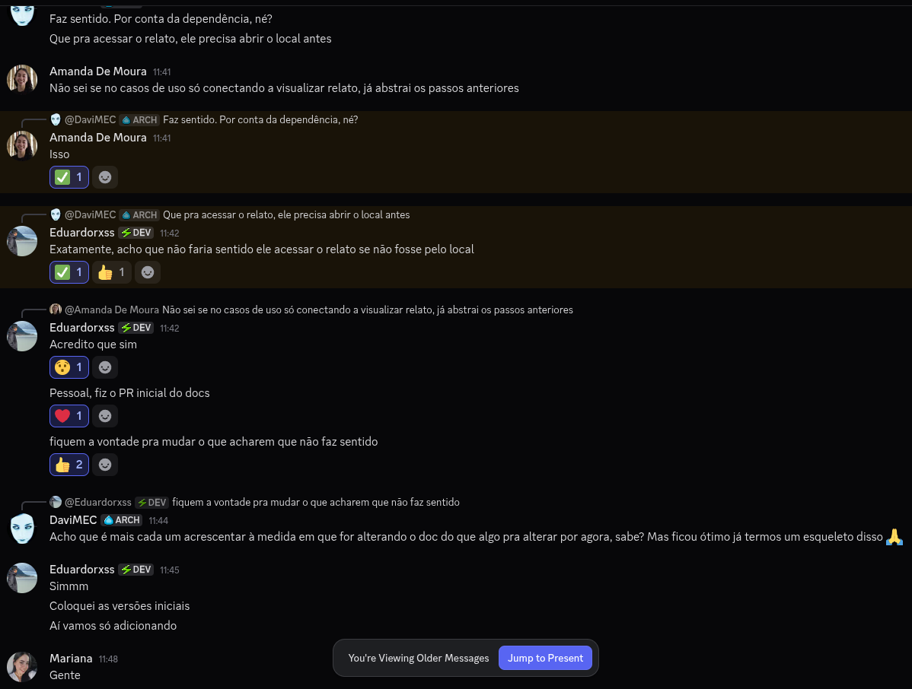
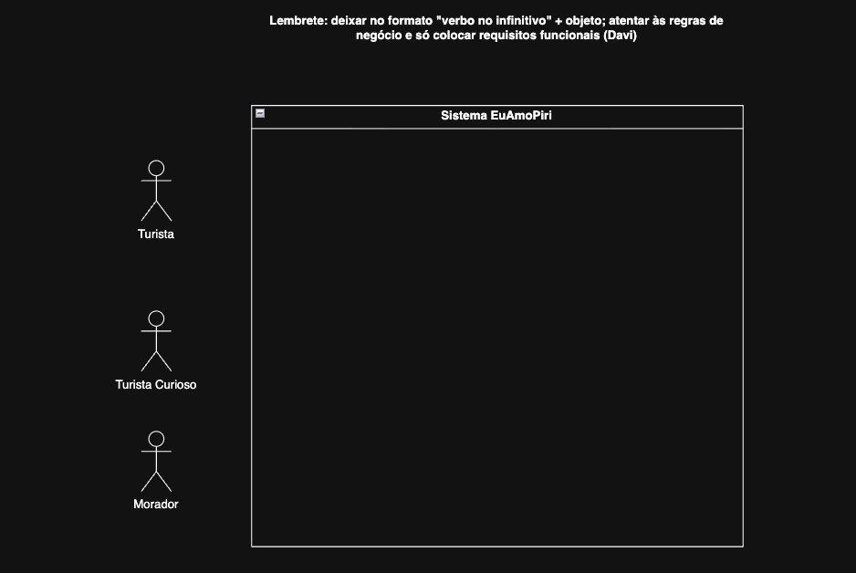
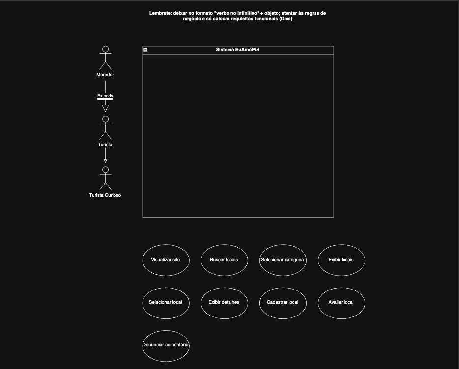
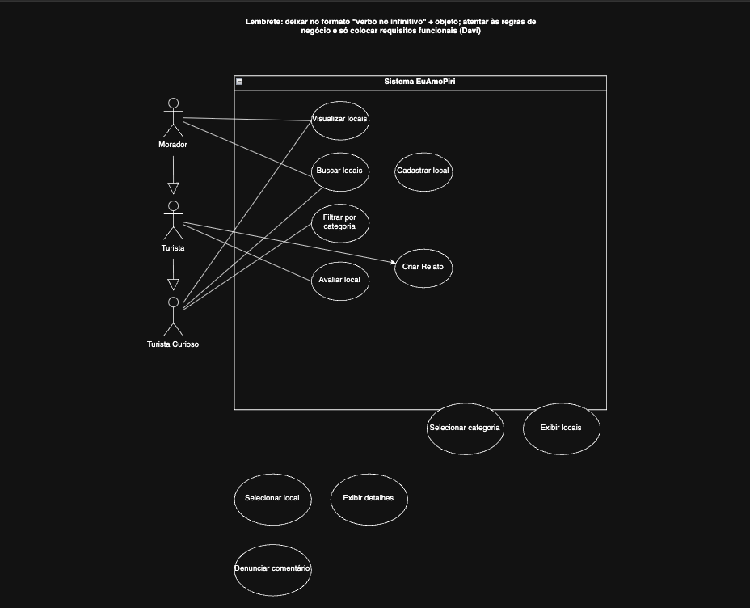
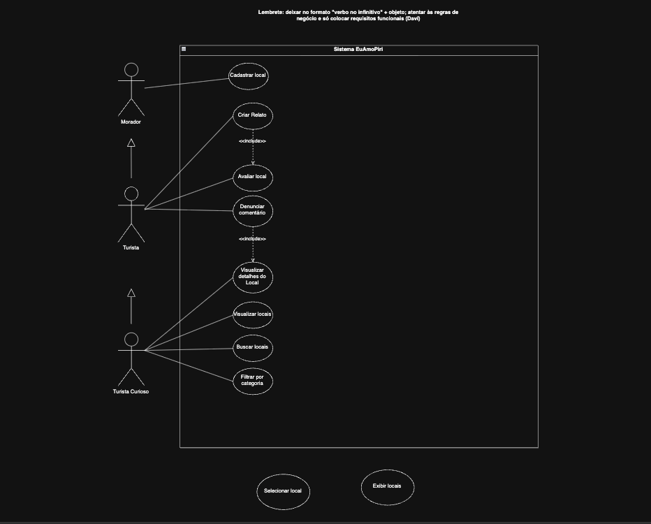

# 2.3.1 Casos de Uso

## Introdução

O diagrama de casos de uso, pertencente à UML, é uma técnica de modelagem utilizada para representar as funcionalidades de um sistema a partir da perspectiva dos usuários que interagem com ele. Esse tipo de diagrama permite identificar os serviços oferecidos pelo sistema, bem como os diferentes atores envolvidos e suas respectivas interações.

## Objetivo

O diagrama tem como finalidade apoiar a compreensão e validação dos requisitos funcionais, facilitando a comunicação entre os membros da equipe e demais stakeholders. Dessa forma, contribui para o alinhamento das expectativas e serve como base para as etapas posteriores do desenvolvimento do sistema.

## Metodologia

Para confecção deste artefato, usamos o Discord de maneira assíncrona, especialmente para discussão de alguns tópicos e para resolver problemas relativos à documentação.

## Evolução do Artefato

### Versão 1.0

Figura 1 - Diagrama de Casos de Uso com atores

Eduardo: Nesta primeira versão do diagrama de casos de uso, foi realizada uma modelagem inicial com o objetivo de identificar os atores envolvidos. Nesse estágio, ainda não havia uma definição clara das responsabilidades de cada ator, Apesar disso, a versão serviu como base para compreensão do escopo do sistema e para direcionar melhorias nas iterações seguintes.

### Versão 1.1

Figura 2 - Diagrama com Casos de Uso

Davi: Durante esta versão, eu peguei algumas das atividades descritas durante o diagrama de atividades e coloquei dentro do sistema para que pudéssemos nos orientar melhor em relação às funcionalidades do sistema. Aproveitei e deixei um lembrete acima do diagrama com algumas regrinhas que eu tinha visto em Requisitos com o George no semestre passado, porque na matéria dele também chegamos a montar um diagrama de casos de uso.

### Versão 1.2

Figura 3 - Diagrama com Associações

Eduardo: Nesta versão foi inciada as associações e também começou a se tornar mais evidente a separação entre funcionalidades acessíveis a usuários logados e não logados.

### Versão 1.3

Figura 4 - Diagrama com mais associações e dependêncisa

Eduardo: Nesta etapa, o diagrama foi refinado com a introdução de relações entre casos de uso, utilizando o conceito de Include para representar dependências funcionais. Por exemplo, a funcionalidade de criar relato passou a incluir a ação de avaliar local, refletindo com mais precisão o comportamento esperado do sistema. Também houve melhorias na organização visual, reduzindo cruzamentos e tornando o diagrama mais legível.

## Visão dos contribuidores na concepção do diagrama

Davi: este diagrama já é um velho conhecido desde MDS, na verdade, mas revisto em Requisitos e agora em Arquitetura, então creio que não houve tanto mistério acerca da feitura dele. Claro que algumas dúvidas podem aparecer em relação ao <<include>> e <<extend>>, mas de maneira geral, senti que já estava preparado para lidar com ele. 

Eduardo:

Amanda:

Mariana:

## Referências

1. UML DIAGRAMS. Use Case Diagrams. Disponível em: <https://www.uml-diagrams.org/use-case-diagrams.html>. Acesso em: 23 abr. 2026.

## Histórico do Artefato

| Data       | Versão | Descrição                                                 | Autor                                                      | Revisores |
| ---------- | ------ | --------------------------------------------------------- | ---------------------------------------------------------- | --------- |
| 22/04/2026 | `1.0`  | Inserção de Atores                                        | [Eduardo](https://github.com/EduardoRibeiroXavier)         |  |
| 22/04/2026 | `1.1`  |                                                           | [Davi do Egito](https://github.com/daviegito)              |  |
| 22/04/2026 | `1.2`  | Iniciada as Associações entre os atores e casos de uso    | [Eduardo Ribeiro](https://github.com/EduardoRibeiroXavier) |
| 22/04/2026 | `1.3`  | Inserção de dependências funcionais entre os casos de uso | [Eduardo Ribeiro](https://github.com/EduardoRibeiroXavier) |

## Histórico do documento

| Data       | Versão | Descrição                                                      | Autor                                                      | Revisores |
| ---------- | ------ | -------------------------------------------------------------- | ---------------------------------------------------------- | --------- |
| 23/04/2026 | `1.0`  | Criação inicial do documento e elaboração dos tópicos iniciais | [Eduardo Ribeiro](https://github.com/EduardoRibeiroXavier) |
| 23/04/2026 | `1.1`  | Escrita inicial da metodologia e adição da visão dos contribuidores e comentário da versão 1.1 | [Davi do Egito](https://github.com/daviegito) |
