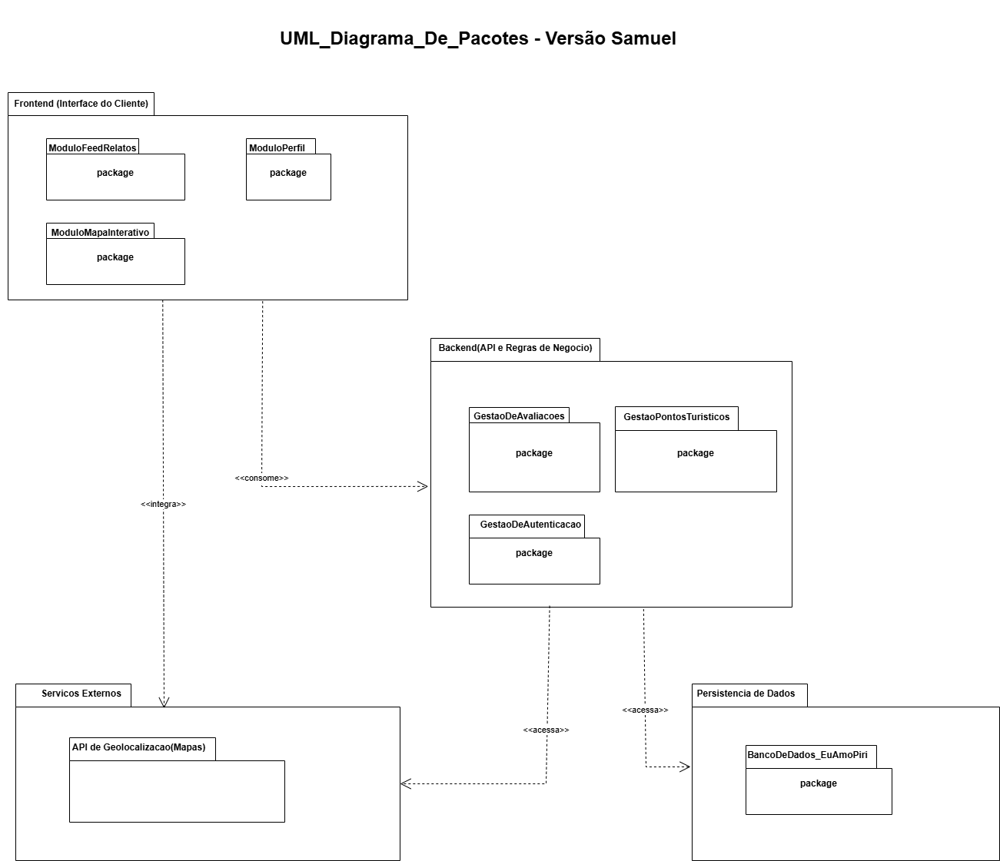
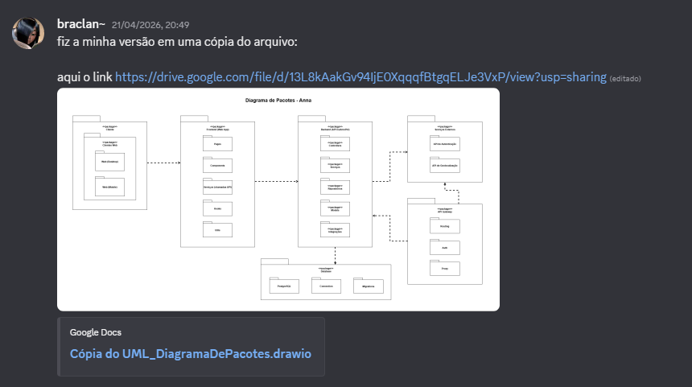
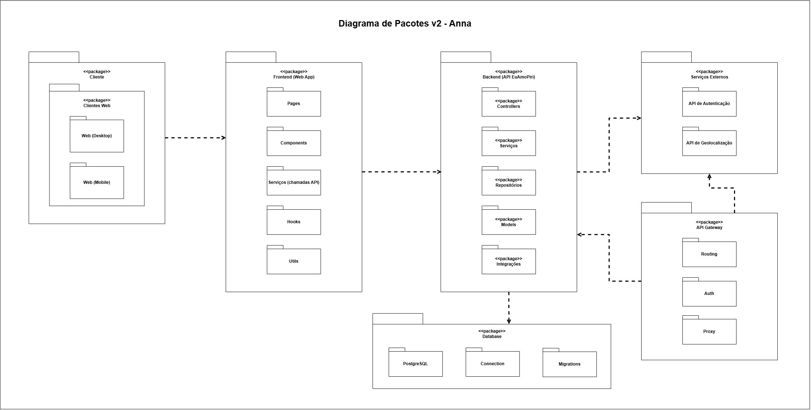
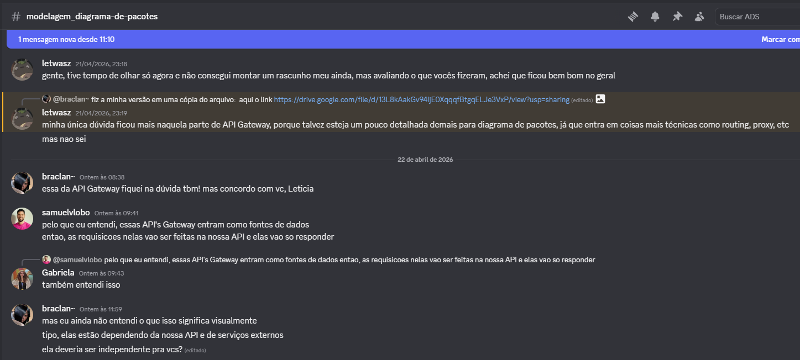
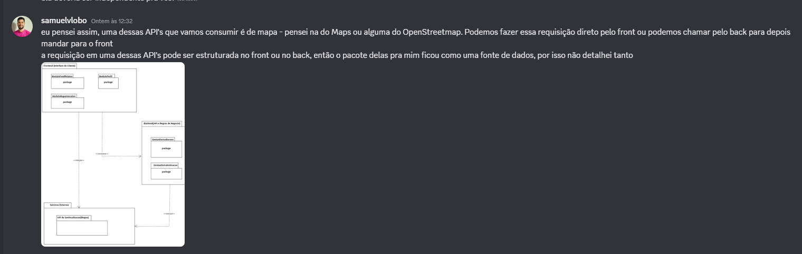
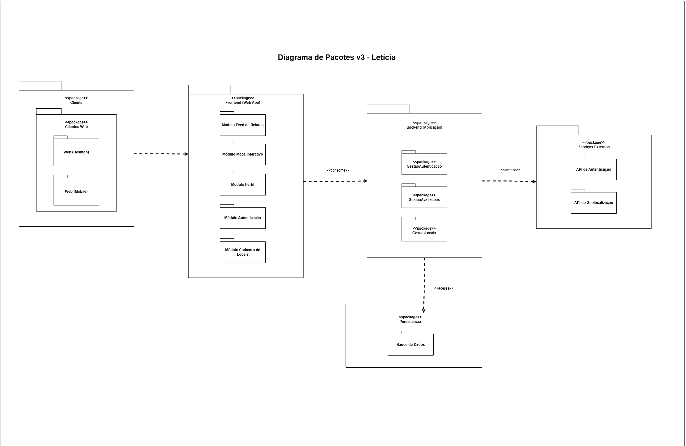
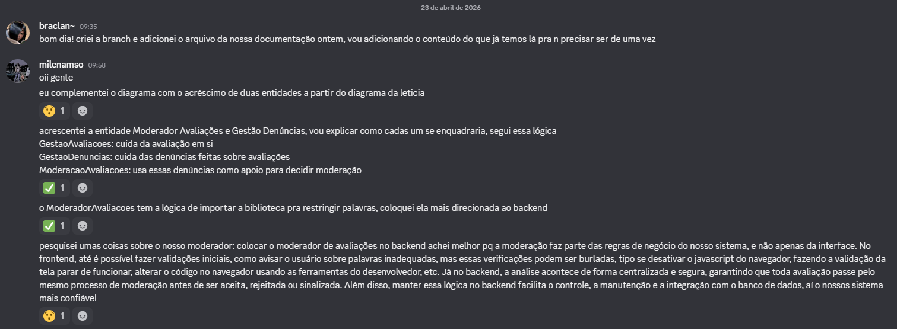
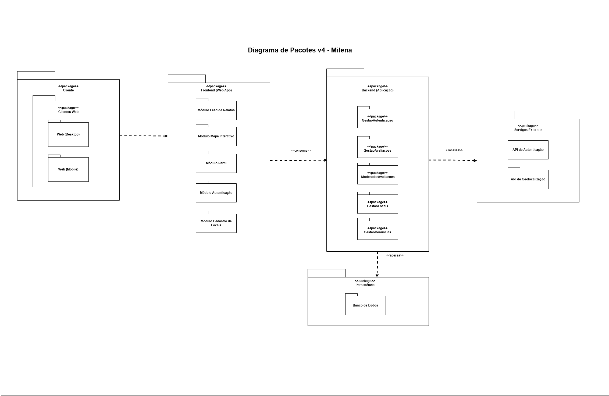
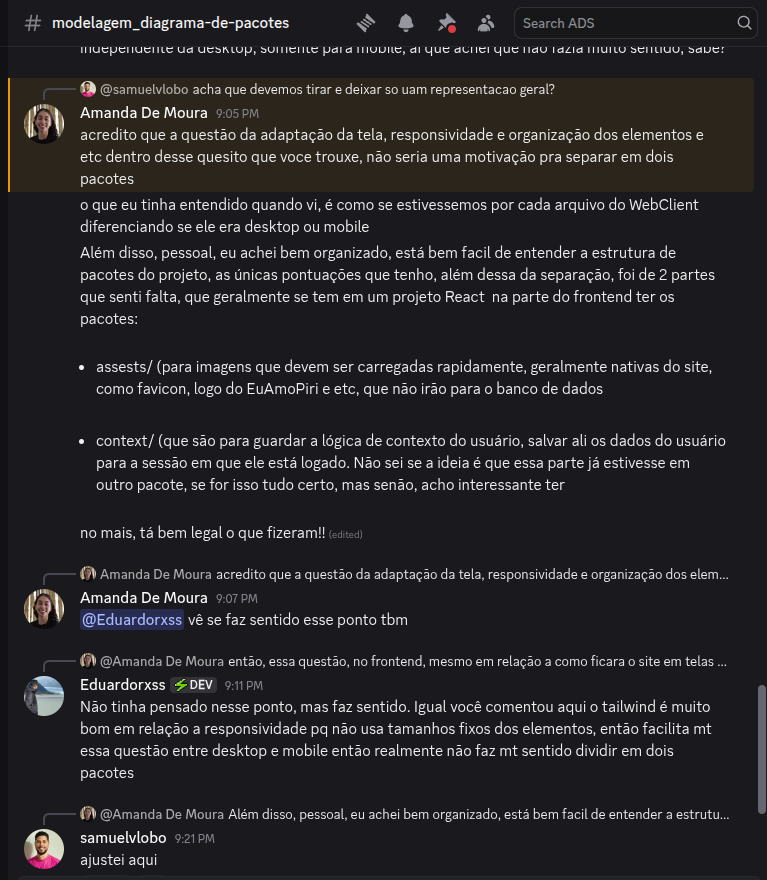
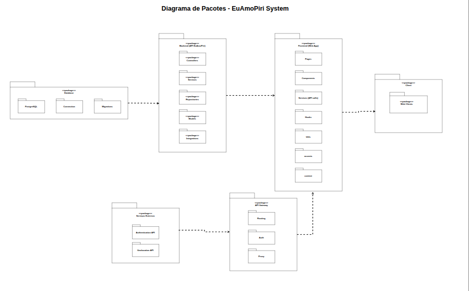

# 2.3.2 Diagrama de Pacotes

---

## Introdução

O **Diagrama de Pacotes** é um dos diagramas estruturais da UML (*Unified Modeling Language*) utilizado para representar a organização e a estrutura de sistemas de forma modular. Ele permite agrupar elementos relacionados — como classes, componentes, casos de uso e até outros pacotes — dentro de unidades chamadas *pacotes*, facilitando a visualização e o entendimento da arquitetura do sistema.

Esse tipo de diagrama é especialmente útil em projetos de maior escala, pois apresenta uma visão hierárquica e simplificada dos elementos, reduzindo a complexidade de outros diagramas, como o de classes. Além disso, possibilita identificar as dependências entre diferentes partes do sistema, evidenciando como os módulos se relacionam e interagem entre si.

Ao organizar os elementos de maneira lógica e visual, o diagrama de pacotes contribui para uma melhor compreensão, manutenção e evolução do sistema, sendo amplamente utilizado na modelagem de arquiteturas em camadas e na documentação de projetos de software. (“Tutorial sobre diagramas de pacotes UML”, [s.d.])

---

## Metodologia

Para a construção deste diagrama, utilizamos a ferramenta **Draw.io** e seguimos as diretrizes da **Linguagem de Modelagem Unificada (UML)**.

Para a nossa comunicação, optamos por centralizar todas as discussões através do canal da equipe no **Discord**, por lá fomos alinhando o andamento de cada versão, e dando avisos para a revisão via GitHub, de forma totalmente assíncrona.

Para a construção deste diagrama foram alocadas 5 pessoas como executoras:

- [Anna Clara][Anna] (braclan~);
- [Gabriela][Gabriela] (Gabriela);
- [Letícia][Leticia] (letwasz);
- [Milena][Milena] (milenamso);
- [Samuel][Samuel] (samuelvlobo).

E 4 pessoas como revisoras oficiais:

- [Amanda][Amanda] (Amanda De Moura);
- [Davi][Davi] (DaviMEC);
- [Eduardo][Eduardo] (Eduardorxss);
- [Mariana][Mariana] (Mariana).

O restante da equipe ficou responsável por acompanhar a construção e opinar caso fosse necessário.

Pelo **Discord** realizamos o compartilhamento de cada link ou foto relevantes para o andamento da construção do Diagrama de Implantação. Abaixo constam algumas das evoluções constatadas por lá, como a criação do template utilizado no **Draw.io** e uma primeira versão do Diagrama idealizada pelo [Samuel][Samuel]:

Seguida da segunda versão do Diagrama, idealizada pela [Anna Clara][Anna]:

(PROFESSOR PAIVA, 2021)

Com 2 modelos idealizados, a equipe passou a discutir sugestões e possíveis mudanças que poderiam ser feitas:

Com a análise de mais membros da equipe, surgiram novas sugestões e discussões:

A partir destas discussões e sugestões, uma terceira versão do Diagrama foi idealizada pela [Letícia][Leticia]:

Decidimos que era hora de começar a documentar nossos avanços e uma quarta versão do Diagrama foi idealizada pela [Milena][Milena]:

Com a soma das 4 versões idealizadas, o [Davi][Davi] revisou de forma individual cada Diagrama e compartilhou suas observações e sugestões:

Os revisores trouxeram novos pontos:

Fizemos ajustes e  o último revisor deu OK:

---

**Diagrama de Pacotes:**

Versão final:

<!--Adicionar o restante ao fim da construção-->
---
## Análise e Resultados

Abaixo, listamos toda a arquitetura pensada e construída e suas respectivas descrições.

### Pacote Client

O acesso e a interação visual do usuário com o sistema são modelados pelo pacote `<<package>> Client`. Ele é o ponto de partida da interação estrutural, representando o ambiente onde a aplicação é renderizada e consumida.

Dentro desse pacote temos:

* **Web Client**: representa o cliente web por onde o usuário interage diretamente com o mapa interativo e as postagens.

Esse pacote não possui regras de negócio complexas, dependendo exclusivamente da camada visual (Frontend) para funcionar adequadamente.

### Pacote Frontend (Web App)

O `<<package>> Frontend (Web App)` é responsável por agrupar todos os elementos de interface de usuário (UI) e a lógica de apresentação do sistema.

Dentro dele temos:

* **Pages**: componentes estruturais que representam as páginas e telas completas da aplicação.
* **Components**: elementos visuais independentes e reutilizáveis (como botões e modais).
* **Services (API calls)**: módulo encarregado de padronizar e realizar as requisições HTTP para o Gateway/Backend.
* **Hooks**: funções encapsuladas para gerenciar o ciclo de vida e as lógicas de estado da interface.
* **Utils**: conjunto de funções utilitárias e de formatação de uso geral.
* **assets**: arquivos estáticos do sistema, como imagens e fontes.
* **context**: responsável pelo gerenciamento de estado global da interface.

Esse pacote atua puramente na **apresentação e interação com o turista**, garantindo que a visualização fique separada do núcleo lógico, em forte alinhamento aos princípios de Desenho de Software.

### Pacote API Gateway

O `<<package>> API Gateway` atua como um escudo e intermediário centralizador das requisições geradas pelo Frontend.

Dentro dele temos:

* **Routing**: responsável por rotear e direcionar as chamadas para os serviços adequados no backend.
* **Auth**: lida com validações iniciais de autenticação e tokens.
* **Proxy**: realiza o repasse e o encaminhamento seguro das requisições.

Centraliza o acesso externo, ajudando ativamente na **segurança, controle de tráfego e padronização da comunicação**, garantindo que o backend não receba chamadas diretas sem tratamento.

### Pacote Backend (API EuAmoPiri)

O `<<package>> Backend (API EuAmoPiri)` contém a lógica principal do sistema, abrigando as regras de negócio e atuando como o verdadeiro núcleo de processamento do projeto.

Dentro dele temos:

* **Controllers**: recebem as requisições roteadas pelo gateway e devolvem as respostas.
* **Services**: camada onde residem as regras de negócio estritas e validações da aplicação.
* **Repositories**: padrão dedicado à abstração e gestão das consultas e persistência no banco de dados.
* **Models**: representação das estruturas de dados e entidades do domínio (como Turistas e Relatos).
* **Integrations**: submódulo para gerenciar a comunicação e integração com serviços externos.

Esse pacote processa o fluxo lógico da aplicação sem se misturar com a interface, demonstrando um forte viés organizacional orientado aos padrões **GRASP de alta coesão e baixo acoplamento**.

### Pacote Database

O `<<package>> Database` representa a camada estrutural da persistência física dos dados.

Dentro dele temos:

* **PostgreSQL**: pacote indicativo do Sistema Gerenciador de Banco de Dados (SGBD) relacional escolhido.
* **Connection**: módulos voltados para a gestão do pool de conexões com o banco.
* **Migrations**: versionamento e controle das alterações do esquema de tabelas do banco de dados.

Esse módulo **isola a infraestrutura de armazenamento** para que seja manipulada unicamente pelas regras e repositórios contidos no backend.

### Pacote Serviços Externos

O `<<package>> Serviços Externos` encapsula as dependências lógicas de APIs fornecidas por terceiros.

Dentro dele temos:

* **Authentication API**: serviço terceirizado para validação de usuários (como fluxos OAuth).
* **Geolocation API**: serviço de mapas essencial para carregar os pontos turísticos e rotas em Pirenópolis.

A segregação deste pacote evidencia que instabilidades ou trocas nas integrações externas **não impactam diretamente a estrutura central** do EuAmoPiri.

### Dependências entre os Pacotes

O sistema utiliza relações de dependência (representadas pelas setas tracejadas) para organizar e modularizar o fluxo de comunicação:

* **Client -> Frontend**: o cliente demanda e consome a carga visual.
* **Frontend -> API Gateway**: a comunicação isolando o acesso direto ao servidor lógico.
* **API Gateway -> Backend & Serviços Externos**: o roteamento das requisições após passarem pelo crivo do "porteiro".
* **Backend -> Database**: as regras de negócio acessando os dados persistidos.

O Diagrama de Pacotes foi concebido para garantir:

1. **Estilo arquitetural de N-Camadas (N-Tier)**: fundamental e preparatório para o Documento de Arquitetura de Software (DAS).
2. **Alta Coesão e Baixo Acoplamento**: dividindo as responsabilidades lógicas e visuais de forma que a manutenção de um módulo não resulte na quebra do restante do sistema.
---

## Visão dos contribuidores na concepção do diagrama

- **Anna:** Tive uma certa dificuldade de iniciar minha primeira versão do Diagrama de Pacotes, mesmo com os materiais disponibilizados, não sabia como aplicar a construção dele no projeto Eu Amo Piri. Com a primeira versão feita pela equipe eu consegui ter mais ideias de como aplicar e, na minha visão, melhorar o modelo já feito. Então fui me baseando nos materiais que pesquisei na internet e consegui construir a segunda versão do Diagrama.

- **Gabriela:**

- **Leticia:**

- **Samuel:** Após ter feito alguns diagramas anteriormente, pude ter uma visão e um entendimento melhor de UML, o que facilitou a execução do Diagrama de Pacotes. Ainda assim, pude aprender bastante com a prática, pegando uma noção melhor de projeto e a visão macro de como o sistema se estrutura. Essa etapa foi fundamental para entender como organizar as dependências entre os módulos e garantir que a arquitetura siga uma lógica de separação de responsabilidades, facilitando a manutenção futura do sistema.

---

## Referências Bibliográficas

> KIRILL FAKHROUTDINOV. **Unified Modeling Language (UML) description, UML diagram examples, tutorials and reference for all types of UML diagrams - use case diagrams, class, package, component, composite structure diagrams, deployments, activities, interactions, profiles, etc.** Disponível em: <https://www.uml-diagrams.org/>. Acesso em: 21 abr. 2016.

> PROFESSOR PAIVA. **Curso de UML - Diagrama de Pacotes.** Disponível em: <https://www.youtube.com/watch?v=o4srs54NciI>. Acesso em: 21 abr. 2026.

> **Tutorial sobre diagramas de pacotes UML.** Disponível em: <https://www.lucidchart.com/pages/pt/diagrama-de-pacotes-uml>. Acesso em: 21 abr. 2026

---

## Histórico de Versão do Artefato

| Versão | Data | Descrição | Autor(es) | Revisor(es) |
| :----: | :--: | :-------: | :-------: | :---------: |
| 1.0.0 | 21/04/2026 | Criação do arquivo de Diagrama de Pacotes no draw.io (link enviado no canal do grupo no Discord). | [Samuel][Samuel] | - |
| 1.0.0 | 21/04/2026 | Criação de versão de Diagrama com estudos próprios. | [Samuel][Samuel] | [Anna Clara][Anna], [Gabriela][Gabriela], [Letícia][Leticia], [Milena][Milena], [Davi][Davi] |
| 1.0.1 | 21/04/2026 | Criação de versão de Diagrama com estudos próprios. | [Anna Clara][Anna] | [Samuel][Samuel], [Gabriela][Gabriela], [Letícia][Leticia], [Milena][Milena], [Davi][Davi] |
| 1.0.2 | 22/04/2026 | Criação de versão de Diagrama com estudos próprios. | [Letícia][Leticia] | [Anna Clara][Anna], [Gabriela][Gabriela], [Samuel][Samuel], [Milena][Milena], [Davi][Davi] |
| 1.0.3 | 23/04/2026 | Criação de versão de Diagrama com estudos próprios. | [Milena][Milena] | [Anna Clara][Anna], [Gabriela][Gabriela], [Letícia][Leticia], [Samuel][Samuel], [Davi][Davi] |
| 1.0.4 | 23/04/2026 | Criação de versão de Diagrama com estudos próprios. | [Samuel][Samuel] | [Anna Clara][Anna], [Gabriela][Gabriela], [Letícia][Leticia], [Milena][Milena], [Davi][Davi] |

## Histórico do documento

| Versão | Data | Descrição | Autor(es) | Revisor(es) |
| :----: | :--: | :-------: | :-------: | :---------: |
| 1.0.0 | 22/04/2026 | Criação da branch e arquivo para adição de conteúdo acerca do Diagrama de Pacotes. | [Anna Clara][Anna] | - |
| 1.0.1 | 23/04/2026 | Adição de conteúdo inicial, até onde a equipe discutiu e construiu (Metodologia). | [Anna Clara][Anna] | - |
| 1.0.2 | 23/04/2026 | Adição de referências bibliográficas. | [Anna Clara][Anna] | - |
| 1.0.3 | 23/04/2026 | Adição de Introdução e Visão de Contribuidora. | [Anna Clara][Anna] | - |
| 1.0.4 | 23/04/2026 | Adição Versao final. | [Samuel][Samuel] | [Amanda][Amanda], [Davi][Davi], [Eduardo][Eduardo], [Mariana][Mariana] |

[Anna]: https://github.com/annacbrandao
[Gabriela]: https://github.com/gabrieladouradof
[Samuel]: https://github.com/Samuelvlobo
[Leticia]: https://github.com/leticiakrpaiva
[Milena]: https://github.com/milenamso
[Amanda]: https://github.com/AmandaaMoura
[Davi]: https://github.com/daviegito
[Eduardo]: https://github.com/EduardoRibeiroXavier
[Mariana]: https://github.com/Marianamrts
